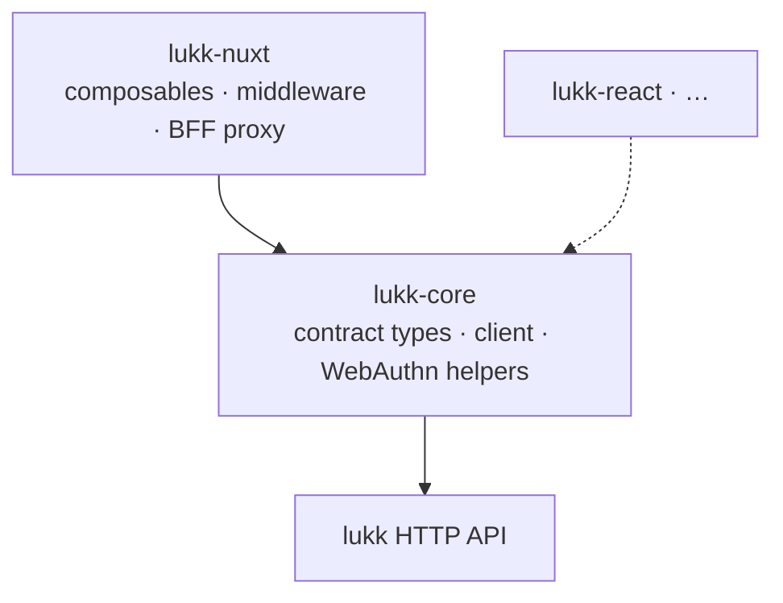

# Architecture

This is the code-level reference: how lukk and lukk-js are put together, why, and where the swap seams are. For the security invariants and the audit checklist see [Security](/security); for the token internals, [Tokens & Rotation](/tokens-and-rotation).

## Why a custom package

lukk deliberately does not use Passport, `league/oauth2-server`, or `tymon/jwt-auth`. OAuth's authorization-code / PKCE / confidential-client machinery exists to delegate access to **third parties** — client IDs, redirect URIs, an authorization server. A **first-party** application, where you own both the client and the API, has no third party to delegate to, so all of that is ceremony with no payoff.

lukk replaces it with a direct credential login that mints its own tokens, and keeps only the OAuth-world patterns that genuinely carry weight: **short-lived access JWTs, opaque rotating refresh tokens, reuse detection, and a denylist.** The one firm rule: the JWS layer is delegated to the audited `firebase/php-jwt`. Hand-rolling JWT encode/verify is exactly where `alg=none`, RS256→HS256 confusion, and non-constant-time comparisons creep in — lukk's code touches **lifecycle and policy**, never the crypto primitives.

## Server (Laravel)

### Layered design

The architecture mirrors Sanctum:

| Layer | Responsibility |
|---|---|
| **Controllers** | Thin — run an Action, return a Response contract. |
| **Actions** | Single-purpose orchestration; the policy lives here. |
| **Contracts** | The swap seams — issuer, verifier, repository, denylist, responses. |
| **Concrete implementations** | The defaults bound to each contract. |

This separation is what makes lukk customizable without edits (see [Customization](/customization)). Critically, the rotation **policy** (in `Actions\RotateRefreshToken`) is separate from token **storage** (behind `Contracts\RefreshTokenRepository`), so you can swap the database for Redis without touching the security-critical logic.

Controllers are resource-oriented — one resource (or single-action `__invoke`) controller per concern, using resourceful verbs (`store`/`destroy`/`index`), never one god-controller — and stay thin: run an Action, return a Response contract.

### The customization hub

Customization is Sanctum-style, through three coordinated mechanisms:

- the static **`Lukk`** hub with closure hooks — `authenticateUsing`, `tokenClaimsUsing`, `useRefreshTokenModel`, `actingAs`, `disableScheduling`;
- **feature flags** in `config('lukk.features')` — 2FA and passkeys are opt-in and never autoloaded unless enabled;
- **rebindable contracts** — bind your own implementation of any swap seam in a service provider.

If you've used `Sanctum::usePersonalAccessTokenModel()`, you already know how to customize lukk. See [Customization](/customization).

### Where the concrete code lives

The default implementations bound to each contract live under `Tokens/`, `Refresh/`, `TwoFactor/`, `Passkeys/`, `Support/`, and `Http/Responses/`. The signing/verification material is resolved by `Tokens\Jwt\KeyRing`, with the algorithm pinned from config (never read from the token header). Responses implement Laravel's `Responsable` contract so you can reshape the output.

## Client (Nuxt)

### Two layers

lukk-js is a framework-agnostic core with per-framework bindings on top:

`lukk-core` knows the lukk contract and how to *speak* it. It knows nothing about storage, reactivity, or any framework. `lukk-nuxt` supplies those — Nuxt `useState`, route middleware, a Nitro proxy — by wiring the core's hooks. A future `lukk-react` would do the same with React state, reusing the entire core unchanged. This is why the core has zero runtime dependencies: it's pure contract plus plumbing.

### The hooks seam

`createLukkClient(hooks)` is the seam. The client never decides *where* a token lives or *how* a refresh happens — it asks, through hooks:

- `getAccessToken` / `onTokens` — read and persist the access token.
- `refresh` — produce a fresh pair on demand.
- `getConfirmationToken` — supply the step-up token to auto-attach.

A binding fills these in for its world. In `lukk-nuxt`'s direct mode they read/write SSR-safe `useState`; in BFF mode the Nitro proxy fills the same role server-side. Same core, different seam wiring. See [Using lukk-core](/lukk-core).

### One API, two transports

The composables expose one surface; a config switch chooses the [transport](/transport-modes) beneath it:

- **`direct`** — the client plugin points the core's `baseURL` at lukk and stores the access token in memory.
- **`bff`** — the client points at the same-origin proxy (`/api/_lukk`), and a Nitro handler captures the tokens into a sealed cookie, refreshing server-side on a 401.

The proxy is the only mode-specific code; the composables don't know which mode they're in. That's what lets you change `mode` without touching a component.

### Refresh & retry

When a request returns `401`, the client calls `refresh` once and retries the original request with the new token. Concurrent 401s — common under SSR or a burst of parallel requests — are collapsed into a **single in-flight refresh** (`singleFlight`), so a page that fires ten requests at once triggers one refresh, not ten. The BFF proxy single-flights its server-side refresh per session for the same reason. Both dovetail with lukk's [grace window](/tokens-and-rotation#the-grace-window), which tolerates concurrent refreshes without treating them as token reuse.

## Mapping the two halves

Every lukk-js concept has a lukk counterpart:

| lukk-js | lukk |
|---|---|
| `direct` mode | `cookie_mode => true` |
| `bff` mode | `cookie_mode => false` (body mode) |
| `useLukkConfirmation` | the `lukk.confirm` step-up middleware |
| `X-Lukk-Confirmation` auto-attach | `confirm.header` |
| single-flight refresh | the rotation grace window |
| `useLukkPasskeys` / `useLukkTwoFactor` | the `passkeys` / `two_factor` features |

## Conformance

A hand-written TypeScript type is a guess about the server until something checks it. lukk-js checks it: a [conformance harness](https://github.com/stsepelin/lukk-js/tree/main/conformance) boots a **real lukk instance** (a Laravel app installing the actual package) and runs the client's flows against it, in CI, across **both** delivery modes.

It doesn't stop at shapes — it completes the real ceremonies: a genuine TOTP code clears a 2FA challenge, and a software WebAuthn authenticator runs a full passkey **register → passwordless login**. If lukk changes a response and lukk-js doesn't, conformance goes red. That's the guarantee the contract types are worth trusting — lukk is the source of truth, and conformance proves lukk-js matches it.

## Quality gate

Both packages enforce **100% test coverage** (statements, branches, functions, lines) — the same bar on both sides. Lint and type-checking run in CI alongside the coverage gate and the conformance suite. The Nuxt runtime is unit-tested through a lightweight `#imports` mock, so the tests run without booting Nuxt; the PHP suite runs on Testbench against an in-memory sqlite database.

## References

**IETF RFCs**

- [RFC 7519 — JWT](https://www.rfc-editor.org/rfc/rfc7519)
- [RFC 7515 — JWS](https://www.rfc-editor.org/rfc/rfc7515)
- [RFC 7517 — JWK / JWKS](https://www.rfc-editor.org/rfc/rfc7517)
- [RFC 7518 — JWA](https://www.rfc-editor.org/rfc/rfc7518)
- [RFC 6749 — OAuth 2.0](https://www.rfc-editor.org/rfc/rfc6749) · [RFC 6750 — Bearer Token Usage](https://www.rfc-editor.org/rfc/rfc6750)
- [RFC 8725 — JWT Best Current Practices](https://www.rfc-editor.org/rfc/rfc8725)
- [RFC 9068 — JWT Profile for OAuth Access Tokens (`at+jwt`)](https://www.rfc-editor.org/rfc/rfc9068)
- [RFC 9700 — OAuth 2.0 Security BCP](https://www.rfc-editor.org/rfc/rfc9700)
- [OAuth 2.1 (draft)](https://datatracker.ietf.org/doc/draft-ietf-oauth-v2-1/) · [OAuth 2.0 for Browser-Based Apps (draft)](https://datatracker.ietf.org/doc/draft-ietf-oauth-browser-based-apps/)

**OWASP**

- [Application Security Verification Standard (ASVS)](https://owasp.org/www-project-application-security-verification-standard/)
- [JWT Cheat Sheet](https://cheatsheetseries.owasp.org/cheatsheets/JSON_Web_Token_for_Java_Cheat_Sheet.html) · [Session Management Cheat Sheet](https://cheatsheetseries.owasp.org/cheatsheets/Session_Management_Cheat_Sheet.html)

**Two-factor & passkeys**

- [RFC 6238 — TOTP](https://www.rfc-editor.org/rfc/rfc6238) · [RFC 4226 — HOTP](https://www.rfc-editor.org/rfc/rfc4226) · [RFC 8176 — Authentication Method Reference (`amr`)](https://www.rfc-editor.org/rfc/rfc8176)
- [W3C WebAuthn Level 2](https://www.w3.org/TR/webauthn-2/) · [NIST SP 800-63B](https://pages.nist.gov/800-63-3/sp800-63b.html)

**Libraries**

- [`firebase/php-jwt`](https://github.com/firebase/php-jwt) · [`pragmarx/google2fa`](https://github.com/antonioribeiro/google2fa) · [`web-auth/webauthn-lib`](https://github.com/web-auth/webauthn-framework)

Next: **[Events](/events)**
