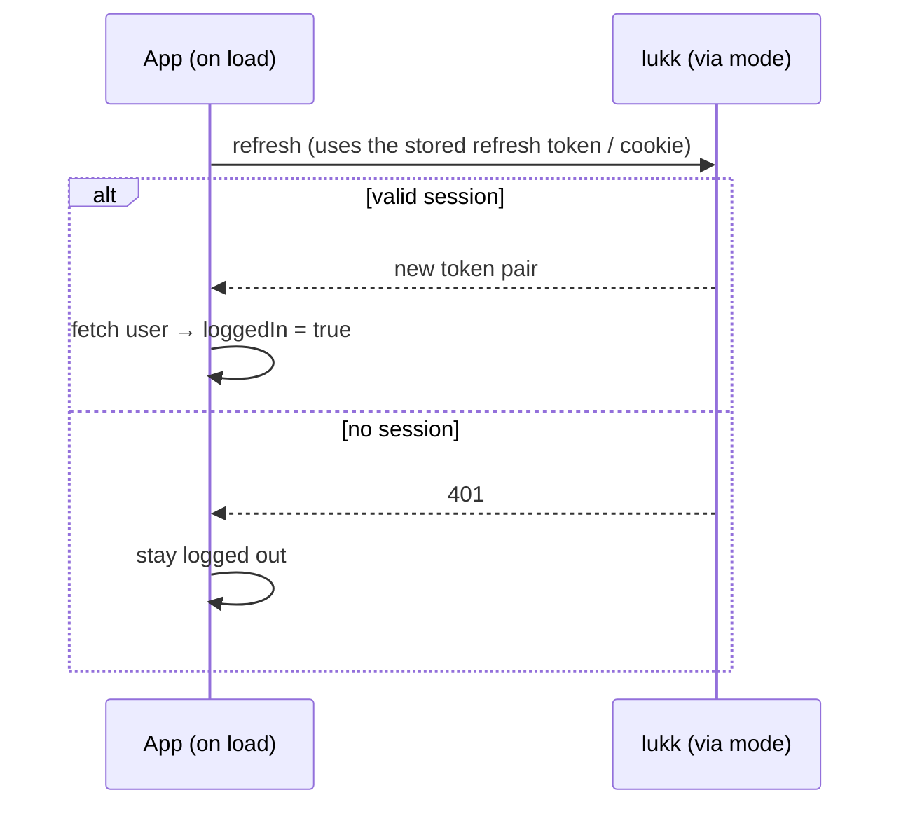

# Authentication

Logging in, refreshing, and logging out — the core session lifecycle, on both halves. The server exposes the `/auth/*` endpoints and mints a `TokenPair`; the client drives them through one composable, `useLukkAuth`. For the authenticated user object itself — the user endpoint, `useLukkAuth().user`, and `UserResource` — see [The User](/user).

## Server (Laravel)

### Endpoints

When `lukk.routes` is `true` (the default), the package registers these routes under the `lukk.path` prefix (default `auth`):

| Method | Path | Middleware | Purpose |
|---|---|---|---|
| `POST` | `/auth/login` | login throttle | Exchange email + password for a token pair. |
| `POST` | `/auth/refresh` | `throttle:lukk-refresh` | Exchange a refresh token for a rotated pair. |
| `POST` | `/auth/logout` | `auth:api` | Revoke the current session. |
| `DELETE` | `/auth/sessions` | `auth:api` | Revoke every session for the user. |
| `DELETE` | `/auth/sessions/others` | `auth:api` | Revoke every session **except** the current one. |

> [!NOTE]
> The login throttle is the per-account failure limiter described in [Configuration → Rate Limits](/configuration#rate-limits), not a route `throttle` middleware. All throttles — login, refresh, two-factor, passkeys — are tunable there.

### Logging in

Post credentials to `/auth/login`:

```http
POST /auth/login
Content-Type: application/json

{ "email": "taylor@example.com", "password": "secret" }
```

On success you receive a token pair (the exact shape depends on the [output mode](#output-modes)):

```json
{
    "access_token": "eyJ0eXAiOiJhdCtqd3Qi...",
    "refresh_token": "9f8c1d...",
    "token_type": "Bearer",
    "expires_in": 900
}
```

Wrong credentials return `422`. Lukk's login is **constant-time**: an unknown email runs the same hashing work as a wrong password, so neither timing nor response shape reveals which accounts exist.

> [!NOTE]
> If the user has confirmed [two-factor authentication](/two-factor-authentication) or you require [passkeys](/passkeys), login returns a challenge instead of tokens. See those pages for the second step.

### Refreshing tokens

When the access token nears expiry, exchange the refresh token for a fresh pair:

```http
POST /auth/refresh
Content-Type: application/json

{ "refresh_token": "9f8c1d..." }
```

Each refresh **rotates** the token: the response contains a brand-new refresh token, and the old one is consumed. Replaying a consumed token after the grace window revokes the entire session — see [Tokens & Rotation → Reuse detection](/tokens-and-rotation).

The grace window (`grace_seconds`, default 30s) exists so concurrent refreshes don't fight. If the same token is presented twice within the window — multiple tabs, or SSR plus hydration — the second call gets a fresh **access** token under the same session, rather than being treated as theft.

> [!NOTE]
> In [cookie mode](#output-modes), the refresh token is read from the `__Host-refresh` cookie automatically, so the request body can be empty.

The full token lifecycle — a short-lived access token used until it nears expiry, then rotated via the long-lived refresh token:

```mermaid
sequenceDiagram
    participant App as App (client)
    participant API as lukk API

    App->>API: POST /auth/login { email, password }
    API-->>App: 200 { access_token (~15m), refresh_token (~30d) }
    App->>API: GET /protected · Authorization: Bearer access
    API-->>App: 200 (guard verifies sig/claims + denylist)
    Note over App: access token nears expiry
    App->>API: POST /auth/refresh { refresh_token }
    API-->>App: 200 { new access_token, new refresh_token } — rotated
    Note over API: old refresh token consumed;<br/>post-grace replay → whole family revoked
```

### Logging out

All logout routes require a valid access token (`auth:api`):

- **`POST /auth/logout`** revokes the current session and denylists its family, killing any access token issued for it within one request.
- **`DELETE /auth/sessions`** revokes every session belonging to the user — useful for a "log out everywhere" button.
- **`DELETE /auth/sessions/others`** revokes every session except the one making the request — useful after a password change.

### Output modes

The `lukk.cookie_mode` option controls where tokens are delivered. From a browser SPA or Nuxt app, the [lukk-js client](#client-nuxt) drives these endpoints for you; its two [transport modes](/transport-modes) pair with the output modes below.

**BFF mode (`cookie_mode => false`, default).** Both tokens are returned in the JSON body. This suits a server-side client — such as a Nuxt BFF — that seals the tokens server-side so the browser never sees them.

```json
{
    "access_token": "...",
    "refresh_token": "...",
    "token_type": "Bearer",
    "expires_in": 900
}
```

**Direct browser mode (`cookie_mode => true`).** The refresh token is set in a hardened `__Host-refresh` cookie (HttpOnly, Secure, `Path=/`, no `Domain`), and only the access token is in the body. This suits a browser client talking to the API directly, with no BFF in front of it.

```json
{
    "access_token": "...",
    "token_type": "Bearer",
    "expires_in": 900
}
```

See [Configuration → Output Mode](/configuration#output-mode) for the config keys.

### Protecting routes

Once the [guard is wired](/installation#wire-the-guard), protect routes with `auth:api` and resolve the user normally:

```php
Route::middleware('auth:api')->group(function () {
    Route::get('/me', fn (Request $request) => $request->user());
    Route::get('/projects', [ProjectController::class, 'index']);
});
```

On every request the guard verifies the JWT (pinning the algorithm and asserting `iss`/`aud`/`exp`/`nbf`), then checks the denylist by both `jti` and `fid`. A token that is expired, tampered, denylisted, or whose user has been deleted is rejected with `401`.

### Starting sessions manually

You don't have to use the built-in login endpoint. To issue tokens yourself — after a custom registration flow, an impersonation feature, or a social login — call `startSession()` on a user (provided by the [`HasRefreshTokens` trait](/installation#prepare-the-user-model-optional)):

```php
$pair = $user->startSession();

$pair->accessToken;   // the signed JWT
$pair->refreshToken;  // the opaque refresh token (shown once)
```

The returned `TokenPair` is a value object; the plaintext refresh token is available only here and is never retrievable again.

> [!NOTE]
> On the client, a custom registration form that hits your own route can bind Laravel validation with the [lukk-js form helper](/use-lukk-form).

## Client (Nuxt)

### `useLukkAuth`

Everything you need for the common case is on one composable, auto-imported in every component, page, and plugin:

```ts
const {
  user,                // Ref<User | null> — the authenticated user (see /user)
  loggedIn,            // ComputedRef<boolean>
  login,               // (credentials) => Promise<LoginResult>
  logout,              // () => Promise<void>
  fetchUser,           // () => Promise<void> — reload the user
  initSession,         // () => Promise<void> — silent restore (runs automatically)
  revokeOtherSessions, // () => Promise<void>
  // two-factor — see /two-factor-authentication:
  pendingTwoFactor,    // ComputedRef<boolean>
  verifyTwoFactor,     // (code) => Promise<void>
  verifyRecoveryCode,  // (recoveryCode) => Promise<void>
} = useLukkAuth()
```

The API is identical in [both transport modes](/transport-modes) — only what happens under the hood differs. Each verb maps to a lukk route; see [the endpoints](#endpoints) above for the server contract. For `user` and `fetchUser`, see [The User](/user).

### Logging in

Call `login` with the user's credentials:

```vue
<script setup lang="ts">
const { login } = useLukkAuth()

const email = ref('')
const password = ref('')
const error = ref('')

async function onSubmit() {
  error.value = ''
  try {
    await login({ email: email.value, password: password.value })
    await navigateTo('/dashboard')
  }
  catch (e) {
    error.value = (e as { message?: string }).message ?? 'Login failed'
  }
}
</script>
```

On success, the token is persisted and the [user is loaded](/user) — `loggedIn` flips to `true`. A failed login throws a typed [`LukkError`](/lukk-core#errors) (`{ status, message, errors? }`).

**Custom login fields.** `email` and `password` are required, but you may pass **extra fields** — a `remember` flag, a captcha token, a tenant — and they reach Laravel as-is (no cast needed; the input type is `LoginInput = LoginCredentials & Record<string, unknown>`):

```ts
await login({ email: email.value, password: password.value, remember: true, captcha: token.value })
```

lukk ignores unknown fields on the default login path; to actually *act* on them (or accept a different credential field such as `username`), take over login on the **server** with [`Lukk::authenticateUsing`](/customization) — the closure receives the full request. `twoFactorChallenge` accepts extra fields the same way.

> [!NOTE]
> If the user has two-factor authentication enabled, `login` does **not** log them in — it surfaces a challenge (`pendingTwoFactor` becomes `true`) for you to complete. See [Two-Factor Authentication](/two-factor-authentication).

### Logging out

```ts
const { logout } = useLukkAuth()
await logout()
```

This revokes the session on lukk and clears the local state (access token, user, any pending challenge or confirmation) — even if the network call fails, the client is left logged out.

### Session restore

A returning user with a valid refresh token should arrive already logged in. The module registers a client plugin that calls `initSession()` on load, which silently attempts a refresh and, if it succeeds, loads the user:



You don't normally call `initSession()` yourself — the plugin does. It's exposed for tests and custom boot flows.

### Revoking sessions

`revokeOtherSessions()` ends every session **except** the current one — useful after a password change ("log out my other devices"):

```ts
const { revokeOtherSessions } = useLukkAuth()
await revokeOtherSessions()
```

To end *every* session including the current one, just [log out](#logging-out-1).

### Route middleware

The module registers four route middlewares:

| Middleware | Effect |
|---|---|
| `lukk-auth` | Redirects to `/login` when **not** authenticated. |
| `lukk-guest` | Redirects to `/` when **already** authenticated (e.g. to keep logged-in users off the login page). |
| `lukk-verified` | Redirects a logged-in user with an **unverified email** to `/verify-email`. |
| `lukk-confirmed` | Redirects a logged-in user without a recent **step-up confirmation** to `/confirm-password`. |

```vue
<script setup lang="ts">
// pages/dashboard.vue
definePageMeta({ middleware: 'lukk-auth' })
</script>
```

```vue
<script setup lang="ts">
// pages/login.vue
definePageMeta({ middleware: 'lukk-guest' })
</script>
```

`lukk-verified` and `lukk-confirmed` act only on an **authenticated** user, so stack them after `lukk-auth`. They're the client-side redirect; the server's [`lukk.verified`](/email-verification) (409) and [`lukk.confirm`](/confirmation) (423) are the real enforcement.

```vue
<script setup lang="ts">
// pages/settings/security.vue — must be logged in, verified, AND recently confirmed
definePageMeta({ middleware: ['lukk-auth', 'lukk-verified', 'lukk-confirmed'] })
</script>
```

Next: **[The User](/user)**.
