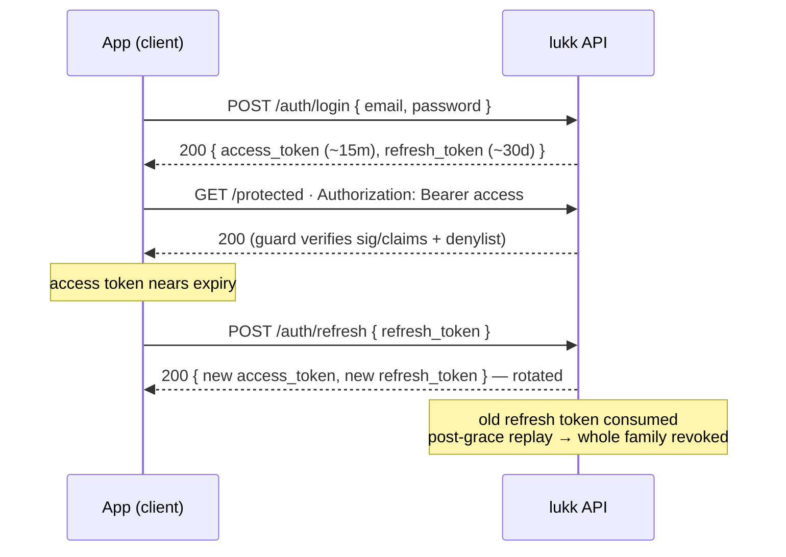
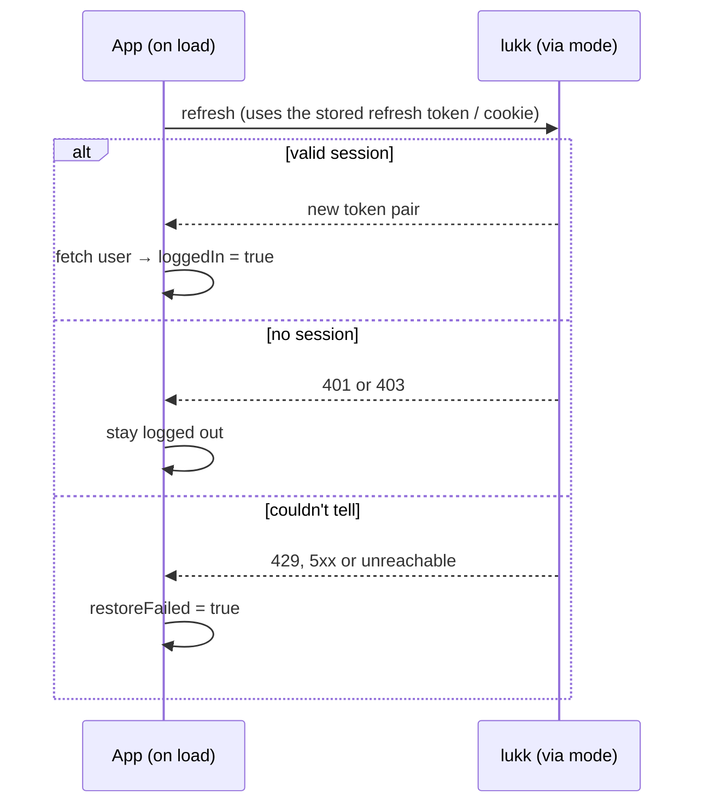

# Authentication

Logging in, refreshing, and logging out — the core session lifecycle, on both halves. The server exposes the `/auth/*` endpoints and mints a `TokenPair`; the client drives them through one composable, `useLukkAuth`. For the authenticated user object itself — the user endpoint, `useLukkAuth().user`, and `UserResource` — see [The User](/user).

## Server (Laravel)

### Endpoints

When `lukk.routes` is `true` (the default), the package registers these routes under the `lukk.path` prefix (default `auth`):

| Method | Path | Middleware | Purpose |
|---|---|---|---|
| `POST` | `/auth/login` | login throttle | Exchange email + password for a token pair. |
| `POST` | `/auth/refresh` | `throttle:lukk-refresh` | Exchange a refresh token for a rotated pair. |
| `POST` | `/auth/logout` | `auth:api` (lukk ≤ 0.6); none from 0.7.0 — see [Logging out](#logging-out) | Revoke the current session. |
| `DELETE` | `/auth/sessions` | `auth:api` | Revoke every session for the user. |
| `DELETE` | `/auth/sessions/others` | `auth:api` | Revoke every session **except** the current one. |
| `POST` | `/auth/session/claim` | `auth:api`, `throttle:lukk-claim` | Confirm the client received a new session (lukk 0.7.0; see [`claim_seconds`](/configuration#refresh-behavior)). `204`. |

> [!NOTE]
> Login is limited twice: a per-IP route throttle (`throttle:lukk-login`, 30 attempts a minute by default) and the per-account failure limiter. Both are described in [Configuration → Rate Limits](/configuration#rate-limits), along with the rest — refresh, two-factor, passkeys, and the two buckets with [no key of their own](/configuration#throttles-without-a-key-of-their-own): the claim route (`lukk-claim`, keyed per **user**) and the logout refresh-token lookup, which has no route throttle at all.

### Logging in

Post credentials to `/auth/login`:

```http
POST /auth/login
Content-Type: application/json

{ "email": "taylor@example.com", "password": "secret" }
```

On success you receive a token pair (the exact shape depends on the [output mode](#output-modes)):

```json
{
    "access_token": "eyJ0eXAiOiJhdCtqd3Qi...",
    "refresh_token": "9f8c1d...",
    "token_type": "Bearer",
    "expires_in": 900
}
```

Wrong credentials return `422`. Lukk's login is **constant-time**: an unknown email runs the same hashing work as a wrong password, so neither timing nor response shape reveals which accounts exist.

Repeated failures are throttled per account and per IP ([rate limits](/configuration#rate-limits)), returning `429`. Those bound a rate; if you also need the NIST SP 800-63B §5.2.2 cap on *consecutive* failures, enable the opt-in [account lockout](/account-lockout), which answers `423` instead.

> [!NOTE]
> If the user has confirmed [two-factor authentication](/two-factor-authentication) or you require [passkeys](/passkeys), login returns a challenge instead of tokens. See those pages for the second step.

### Refreshing tokens

When the access token nears expiry, exchange the refresh token for a fresh pair:

```http
POST /auth/refresh
Content-Type: application/json

{ "refresh_token": "9f8c1d..." }
```

Each refresh **rotates** the token: the response contains a brand-new refresh token, and the old one is consumed. Replaying a consumed token after the grace window revokes the entire session — see [Tokens & Rotation → Reuse detection](/tokens-and-rotation).

The grace window (`grace_seconds`, default 30s) exists so concurrent refreshes don't fight. If the same token is presented twice within the window — multiple tabs, or SSR plus hydration — the second call gets a full token pair under the same session (a sibling refresh token, which the client must store like any other), rather than being treated as theft.

> [!NOTE]
> In [cookie mode](#output-modes), the refresh token is read from the `__Host-refresh` cookie automatically, so the request body can be empty.

The full token lifecycle — a short-lived access token used until it nears expiry, then rotated via the long-lived refresh token:


```mermaid
sequenceDiagram
    participant App as App (client)
    participant API as lukk API

    App->>API: POST /auth/login { email, password }
    API-->>App: 200 { access_token (~15m), refresh_token (~30d) }
    App->>API: GET /protected · Authorization: Bearer access
    API-->>App: 200 (guard verifies sig/claims + denylist)
    Note over App: access token nears expiry
    App->>API: POST /auth/refresh { refresh_token }
    API-->>App: 200 { new access_token, new refresh_token } — rotated
    Note over API: old refresh token consumed<br/>post-grace replay → whole family revoked
```

### Logging out

- **`POST /auth/logout`** revokes the current session and denylists its family, killing any access token issued for it within one request.
- **`DELETE /auth/sessions`** revokes every session belonging to the user — useful for a "log out everywhere" button. Requires a valid access token; switch it off with [`features.logout_all`](/configuration#feature-toggles).
- **`DELETE /auth/sessions/others`** revokes every session except the one making the request — useful after a password change. Requires a valid access token, and answers a bare `204` that leaves the caller's own refresh cookie in place.

Up to lukk 0.6, `POST /auth/logout` also required a valid access token — so a client whose access token had expired (an idle tab) got a `401`, nothing was revoked, and in cookie mode the refresh cookie stayed valid for its whole lifetime.

**From lukk 0.7.0** logout accepts **either** credential:

- a **valid access token** revokes its session exactly as before (and still authenticates the request as its user);
- the **refresh token** the client holds — the `__Host-refresh` cookie in cookie mode, or `refresh_token` in a JSON body — revokes the session it belongs to on that guard.

An expired access token alone is **not** enough, whatever its signature. The answer is always `204`, so nothing reveals whether a token existed. The refresh cookie is only used — and only cleared — on a request a cross-site form can't make: `Content-Type: application/json`, or `Sec-Fetch-Site: same-origin`/`none` (the visitor's own navigation). Deliberately not `same-site`: that is the sibling-subdomain attacker `SameSite=Strict` doesn't stop, and it is also where a direct-mode SPA usually lives — which is why such a client sends an empty JSON body rather than relying on the header (lukk-js does). The refresh-token lookup has its own throttle. It counts lookups that find **no** token — probing always misses — and those for a session that's already revoked; a real logout of a live session never uses it up. The logout itself has no throttle, and a logout whose access token is valid skips the lookup's. When the lookup *is* throttled and nothing else ended the session, logout answers **`429`** with `Retry-After` and leaves the refresh cookie in place — retry it, because the session is still live.

### Output modes

The `lukk.cookie_mode` option controls where tokens are delivered. From a browser SPA or Nuxt app, the [lukk-js client](#client-nuxt) drives these endpoints for you; its two [transport modes](/transport-modes) pair with the output modes below.

**BFF mode (`cookie_mode => false`, default).** Both tokens are returned in the JSON body. This suits a server-side client — such as a Nuxt BFF — that seals the tokens server-side so the browser never sees them.

```json
{
    "access_token": "...",
    "refresh_token": "...",
    "token_type": "Bearer",
    "expires_in": 900
}
```

**Direct browser mode (`cookie_mode => true`).** The refresh token is set in a hardened `__Host-refresh` cookie (HttpOnly, Secure, `Path=/`, no `Domain`), and only the access token is in the body. This suits a browser client talking to the API directly, with no BFF in front of it.

```json
{
    "access_token": "...",
    "token_type": "Bearer",
    "expires_in": 900
}
```

See [Configuration → Output Mode](/configuration#output-mode) for the config keys.

### Protecting routes

Once the [guard is wired](/installation#wire-the-guard), protect routes with `auth:api` and resolve the user normally:

```php
Route::middleware('auth:api')->group(function () {
    Route::get('/me', fn (Request $request) => $request->user());
    Route::get('/projects', [ProjectController::class, 'index']);
});
```

On every request the guard verifies the JWT (pinning the algorithm and asserting `iss`/`aud`/`exp`/`nbf`), then checks the denylist by both `jti` and `fid`. A token that is expired, tampered, denylisted, or whose user has been deleted is rejected with `401`.

### Starting sessions manually

You don't have to use the built-in login endpoint. To issue tokens yourself — after a custom registration flow, an impersonation feature, or a social login — call `startSession()` on a user (provided by the [`HasRefreshTokens` trait](/installation#prepare-the-user-model-optional)):

```php
$pair = $user->startSession();

$pair->accessToken;   // the signed JWT
$pair->refreshToken;  // the opaque refresh token (shown once)
```

The returned `TokenPair` is a value object; the plaintext refresh token is available only here and is never retrievable again.

> [!NOTE]
> For sign-up specifically, prefer the first-party [registration endpoint](/registration) — it starts the session for you (and handles 2FA / email verification) instead of hand-rolling `startSession()`. On the client, a custom form that hits your own route can bind Laravel validation with the [lukk-js form helper](/use-lukk-form).

## Client (Nuxt)

### `useLukkAuth`

Everything you need for the common case is on one composable, auto-imported in every component, page, and plugin:

```ts
const {
  user,                // Ref<User | null> — the authenticated user (see /user)
  loggedIn,            // ComputedRef<boolean>
  ready,               // ComputedRef<boolean> — has the session been resolved? (see below)
  whenReady,           // () => Promise<void> — resolves once `ready` is true
  restoreFailed,       // ComputedRef<boolean> — the restore couldn't reach an answer (see below)
  login,               // (credentials) => Promise<LoginResult>
  logout,              // () => Promise<void>
  fetchUser,           // () => Promise<void> — reload the user
  initSession,         // () => Promise<void> — silent restore (runs automatically)
  revokeOtherSessions, // () => Promise<void>
  // two-factor — see /two-factor-authentication:
  pendingTwoFactor,    // ComputedRef<boolean>
  verifyTwoFactor,     // (code) => Promise<void>
  verifyRecoveryCode,  // (recoveryCode) => Promise<void>
} = useLukkAuth()
```

The API is identical in [both transport modes](/transport-modes) — only what happens under the hood differs. Each verb maps to a lukk route; see [the endpoints](#endpoints) above for the server contract. For `user` and `fetchUser`, see [The User](/user).

### Logging in

Call `login` with the user's credentials:

```vue
<script setup lang="ts">
const { login } = useLukkAuth()

const email = ref('')
const password = ref('')
const error = ref('')

async function onSubmit() {
  error.value = ''
  try {
    await login({ email: email.value, password: password.value })
    await navigateTo('/dashboard')
  }
  catch (e) {
    error.value = (e as { message?: string }).message ?? 'Login failed'
  }
}
</script>
```

On success, the token is persisted and the [user is loaded](/user) — `loggedIn` flips to `true`. A failed login throws a typed [`LukkError`](/lukk-core#errors) (`{ status, message, errors? }`).

**Custom login fields.** `email` and `password` are required, but you may pass **extra fields** — a `remember` flag, a captcha token, a tenant — and they reach Laravel as-is (no cast needed; the input type is `LoginInput = LoginCredentials & Record<string, unknown>`):

```ts
await login({ email: email.value, password: password.value, remember: true, captcha: token.value })
```

lukk ignores unknown fields on the default login path; to actually *act* on them (or accept a different credential field such as `username`), take over login on the **server** with [`Lukk::authenticateUsing`](/customization) — the closure receives the full request. `twoFactorChallenge` accepts extra fields the same way.

> [!NOTE]
> If the user has two-factor authentication enabled, `login` does **not** log them in — it surfaces a challenge (`pendingTwoFactor` becomes `true`) for you to complete. See [Two-Factor Authentication](/two-factor-authentication).

### Logging out

```ts
const { logout } = useLukkAuth()
await logout()
```

This revokes the session on lukk and clears the local state (access token, user, any pending challenge or confirmation) — even if the network call fails, the client is left logged out.

**Await it before navigating away.** The logout request is sent with `keepalive`, so a navigation that starts right after it's sent doesn't cancel it — and if the page starts to unload (or goes hidden) while the logout is still waiting to send (for another tab's lock, or a refresh already out), it's sent right away — skipping the cross-tab lock, since the page is leaving. With lukk 0.7.0, which ends a session by its refresh cookie, that one request is all it takes. A browser fires `pagehide` only after the next page's response has arrived, so that page could still render signed in; the logout therefore leaves a note that the next page load finishes it from, before anything restores:

- **BFF:** a one-minute, same-site cookie (`__Host-lukk-logout`, namespaced like the session cookie), written the moment `logout()` is called. The next request carries it, and the server ends the session before rendering — that page is signed out at once, and the visitor's other tabs follow. Every response that starts a new session clears the note, so it never ends a sign-in that came after it, from any tab. That page's response never clears the session cookie — the logout request the browser sent does that — so a sign-in racing it keeps the cookie it just received. While the note is on a request, the server treats it as signed out — SSR hydration, `getLukkAccessToken` (your own server middleware included) and the app-API proxy — so if lukk can't be reached, the page still renders signed out and the browser finishes the logout itself, in the background.

  Two numbers bound what that page load costs. The server waits at most **5 seconds** on lukk before rendering signed out and leaving the rest to the browser; after a logout that didn't go through it leaves **that session** alone for **10 seconds**, so a page load that fires a dozen requests doesn't wait the timeout a dozen times. Both are held per **server process** and, unlike the record of replaced sessions, are *not* covered by [`session.sharedStore`](/configuration#session-sharedstore) — behind a load balancer without sticky sessions, another instance can spend the timeout again. That is a latency cost, not a correctness one: the visitor reads as signed out on every instance, because the note is on the request.

  When the logout does go through, the server drops the note and answers with `__Host-lukk-signed-out` — a **ten-second** cookie, so the page's restore knows it is signed out without asking lukk and can tell the visitor's other tabs. A cookie rather than a value in the page payload, because a page can be cached and a cookie is per browser. It is withheld — along with any session cookie the logout's own token renewal re-sealed — when a sign-in replaced that session while the response was being produced: that browser now holds a newer session, and either cookie landing late would put it back on the old one. Without it the page simply restores as it normally would.
- **Direct:** a per-tab note naming the session — the access token's family (`fid`). The next page load in that tab (within a minute) restores, and logs out only if it restored that same session; a newer sign-in, from anywhere, is kept. A note written before any token was known, or against a custom `TokenIssuer` that leaves `fid` out, names no session, so the next page load has only the rule below to go on.

  **Every logout, in both transports, stands down right before it sends if a sign-in was recorded after that logout was asked for.** lukk-js notes each sign-in's send time in `localStorage`, and reads it again once the logout reaches the front of the cross-tab queue — which may be seconds later, or a page later still if the tab was restored from the back/forward cache. Positive evidence only: a note that simply went missing could equally have aged out, and that one still has a session to end. A sign-in that doesn't go through lukk-js isn't recorded, and neither is anything at all if the app clears `localStorage`.

  **"After that logout was asked for" is read from the note itself, not from the page that finishes it.** In BFF mode the `__Host-lukk-logout` cookie carries the moment `logout()` was called, so a sign-in that was already on the wire when the finishing page loaded — sent before it, landing after — still counts as having happened since. A direct-mode note carries the same time in its own record. Only a note written by a release that predates the value falls back to the finishing page's clock, which is the older, slightly narrower behaviour.

  **The kept sign-in costs the old session.** When a newer sign-in lands before that page load runs, the note names a session the browser no longer holds, and the only credential that could end it — the refresh cookie — now belongs to the new one. The note is dropped and the older session stays live on lukk until its refresh token expires, even though the visitor asked for it to end. Keeping it is the lesser harm: the alternative is ending the session they just signed into. BFF mode doesn't have this gap, because a sign-in there revokes the session it replaces on lukk, server-side; direct mode has no server to do that from. If it matters, shorten [`refresh_ttl`](/configuration#token-lifetimes), or have the app call `revokeOtherSessions()` after a sign-in.

Against an older lukk with an expired access token, `logout()` still has to renew the token and retry first, and a full page load can cancel that (in direct mode; the BFF renews on the server). `logout()` can also reject — a session that was already gone, a network failure, a `429` from lukk 0.7.0's logout throttle — and it clears local state either way. A `401` whose token renewal ran and still came back rejected means there was no session left to end — and only then is the note dropped. A `401` the renewal could not follow up (throttled, offline) keeps the note, because the session may well be live; anything else means the same (in direct mode the refresh cookie survives, and the next page load restores it), so offer a retry rather than sending the user on:

```ts
try {
  await logout()
}
catch (error) {
  if ((error as { status?: number }).status !== 401) return showLogoutRetry()
}
await navigateTo('/login', { external: true })
```

### Session restore

A returning user with a valid refresh token should arrive already logged in. The module registers a client plugin that calls `initSession()` on load, which silently attempts a refresh and, if it succeeds, loads the user:


```mermaid
sequenceDiagram
    participant App as App (on load)
    participant Lukk as lukk (via mode)
    App->>Lukk: refresh (uses the stored refresh token / cookie)
    alt valid session
        Lukk-->>App: new token pair
        App->>App: fetch user → loggedIn = true
    else no session
        Lukk-->>App: 401 or 403
        App->>App: stay logged out
    else couldn't tell
        Lukk-->>App: 429, 5xx or unreachable
        App->>App: restoreFailed = true
    end
```

You don't normally call `initSession()` yourself — the plugin does. It's exposed for tests, custom boot flows, and [retrying a restore that couldn't reach the server](#when-the-restore-can-t-reach-an-answer).

### Waiting for the session (`ready`)

`loggedIn` is `false` in two different situations: the visitor is **anonymous**, or the session **hasn't been resolved yet**. A redirect, a fetch of account data, or a deep-link restore that runs in the second situation makes the wrong decision — and there's no later event to retry on.

`ready` tells them apart. It becomes `true` once the restore has **finished**, and `restoreFailed` says whether it actually reached an answer:

| `ready` | `loggedIn` | `restoreFailed` | Meaning |
|---|---|---|---|
| `false` | `false` | `false` | Not resolved yet — don't decide anything |
| `true` | `true` | `false` | Signed in |
| `true` | `false` | `false` | Signed out |
| `true` | `false` | `true` | Couldn't tell — see [below](#when-the-restore-can-t-reach-an-answer) |

`loggedIn` means "a user was loaded", so an app with no [`user.endpoint`](/user) reads as signed out even with a valid session.

**Gate decisions on `ready`.** Anything that would be wrong for a signed-in visitor — redirecting to `/login`, skipping a data fetch, dropping a `?id=` from the URL — should wait for it.

#### Where it's `false`

On the **client**, `ready` is already `true` by the time route middleware, component `setup()`, and `onMounted` run: Nuxt awaits the restore plugin before the initial navigation and before mounting the app. When the server [hydrated the user](/transport-modes#ssr-hydration), it's `true` from the very first line of code.

It is `false`:

- **During any server render that didn't hydrate a user.** That includes an anonymous visitor, [direct mode](/transport-modes#direct-mode) (the server never sees the refresh cookie), `ssrHydrate: false`, prerendered routes, a session the server couldn't refresh, and a user endpoint that failed on the server. The server can't tell these apart, so it doesn't claim to know — the client decides after its restore.
- **In a plugin that runs before lukk's `lukk:session-restore`** — see [Waiting from a plugin or a store](#waiting-from-a-plugin-or-a-store).

> [!WARNING]
> **Reading `ready` in a template causes a hydration mismatch** on a server-rendered page the server didn't hydrate a user for — including every anonymous visit. The server renders `false`, and the client sets `true` before mounting. `restoreFailed` does the same whenever the client restore fails. Use them in logic (middleware, handlers, `onMounted`), or put the markup that depends on them inside `<ClientOnly>`. `loggedIn` has always behaved the same way for a session restored on the client.

#### Loading account data

A `useAsyncData` handler that skips when `!loggedIn` runs on the server too. When the server couldn't resolve the session it returns nothing, that empty result is written into the payload, and the page doesn't fetch again when it hydrates. Let the server fetch only when it actually resolved the session:

```ts
const api = useLukkFetch()
const { ready, loggedIn } = useLukkAuth()

const { data: orders } = await useAsyncData('orders',
  () => loggedIn.value ? api('/api/orders') : Promise.resolve([]),
  { server: ready.value, watch: [loggedIn] }, // refetch on login / logout
)
```

When the server hydrated the user, it fetches as usual and the page renders with the data. Otherwise it skips, and the client fetches once the restore has finished — so you don't give up server rendering where it works.

#### Restoring a deep link

In `onMounted` the restore has already finished. `loggedIn` is a real answer unless `restoreFailed` says the restore couldn't reach the server — send that visitor to `/login` and a signed-in user is asked to log in again:

```vue
<script setup lang="ts">
interface Order { id: string, total: number }

const route = useRoute()
const api = useLukkFetch()
const { loggedIn, restoreFailed } = useLukkAuth()
const order = ref<Order | null>(null)

onMounted(async () => {
  if (restoreFailed.value) return // show a retry instead — see below
  if (!loggedIn.value) {
    return navigateTo({ path: '/login', query: { redirect: route.fullPath } })
  }

  // A query value is attacker-controlled. Validate it before it becomes part of a URL that is sent
  // with your credentials — `?id=../me/export` would otherwise reach a different endpoint.
  const id = route.query.id
  if (typeof id === 'string' && /^[\w-]+$/.test(id)) {
    order.value = await api<Order>(`/api/orders/${encodeURIComponent(id)}`)
  }
})
</script>
```

> [!WARNING]
> **Validate the `redirect` parameter where you read it.** `route.fullPath` is always a local path, but your login page receives whatever is in the URL. A pattern check on the raw string isn't enough: the URL parser strips tabs and newlines and resolves dot segments, so `/\t/evil.com` and `/.//evil.com` pass a "starts with `/` but not `//`" test and still lead off-site. Parse it the way the browser will, then check the result:
>
> ```ts
> function safeRedirect(raw: unknown, fallback = '/'): string {
>   if (typeof raw !== 'string' || !raw.startsWith('/')) return fallback
>
>   let url: URL
>   try { url = new URL(raw, 'http://local.invalid') }
>   catch { return fallback }
>
>   // A different origin means the string named another host.
>   if (url.origin !== 'http://local.invalid') return fallback
>
>   // Rebuild from the parsed parts, and refuse a path that would read as protocol-relative.
>   const path = url.pathname + url.search + url.hash
>   return /^\/[/\\]/.test(path) ? fallback : path
> }
>
> await navigateTo(safeRedirect(route.query.redirect))
> ```

#### Waiting from a plugin or a store

Middleware, `setup()` and `onMounted` don't need to wait — they already run after the restore. `whenReady()` is for code that can run earlier or from anywhere: a store, or a composable a plugin calls.

```ts
const defaultPreferences = { theme: 'system' }

export async function loadPreferences() {
  // Call composables before the first `await` — Nuxt's instance isn't guaranteed after it.
  const api = useLukkFetch()
  const { whenReady, loggedIn } = useLukkAuth()

  await whenReady()
  return loggedIn.value ? api('/api/preferences') : defaultPreferences
}
```

Plugins run one after another. A plugin that **awaits** `whenReady()` in its setup and runs *before* `lukk:session-restore` — `enforce: 'pre'`, or one added by a module listed after `lukk-nuxt` — waits on a plugin that can't start until it finishes, and the app never boots. Depending on `lukk:client` doesn't fix that. Depend on the restore plugin by name, **in a `.client.ts` file**: the restore only runs in the browser, so a universal plugin naming it is reported — logged as an error during the build on Nuxt 3 and earlier 4.x releases (the build still succeeds), and only a development warning on recent Nuxt 4.

In development lukk-nuxt warns when `whenReady()` is called before the restore has started. The same call is harmless when it isn't awaited in a plugin's setup, so treat the warning as "check this", not as a failure.

```ts
// plugins/preferences.client.ts
export default defineNuxtPlugin({
  name: 'preferences',
  dependsOn: ['lukk:session-restore'],
  async setup() {
    await loadPreferences()
  },
})
```

> [!WARNING]
> **`whenReady()` resolves immediately on the server**, even when `ready` is `false`. The client restore never runs there, so a render the server didn't hydrate would wait forever. Read `ready` afterwards in code that also runs on the server: `false` means "not known here", not "anonymous".

#### In route middleware

Middleware runs on the server **and again on the client** during hydration. When the server couldn't resolve the session, defer — the client run sees it resolved:

```ts
// middleware/account.ts
export default defineNuxtRouteMiddleware((to) => {
  const { ready, loggedIn, restoreFailed } = useLukkAuth()

  if (to.path === '/login') return
  if (!ready.value || restoreFailed.value) return // unknown — don't send a signed-in user to /login
  if (!loggedIn.value) return navigateTo({ path: '/login', query: { redirect: to.fullPath } })
})
```

Two consequences of deferring, both deliberate:

- **The server renders the protected page for a visitor it couldn't identify**, and the client then redirects them if they turn out to be signed out. Route middleware isn't access control — your API is. Never put protected data in the page from anything but an authenticated API response.
- **When `restoreFailed` is `true`, the visitor stays on the page with no user.** Show the retry state there rather than an empty page.

> [!NOTE]
> The built-in [`lukk-auth`](#route-middleware) middleware does exactly this — it defers while `ready` is `false` and doesn't redirect when `restoreFailed` is `true` — so write your own only to add something, such as the `redirect` query above.

#### When the restore can't reach an answer

Only a `401` or `403` means "no session" — or, in BFF mode, a `409` answered twice in a row, which says the session this browser holds was replaced and the retry couldn't pick up a newer one. Any other failure leaves the visitor signed out **as far as the UI can tell**, though they may well have a valid session: a rate-limited refresh (`429`), a server error (`5xx`), a server that couldn't be reached, or a user endpoint that failed right after a successful refresh. `restoreFailed` is `true` in those cases, so you can offer a retry instead of a login form:

```vue
<script setup lang="ts">
const { loggedIn, restoreFailed, initSession } = useLukkAuth()
const retrying = ref(false)

async function retry() {
  retrying.value = true
  try { await initSession() }
  finally { retrying.value = false }
}
</script>

<template>
  <ClientOnly>
    <AccountMenu v-if="loggedIn" />
    <p v-else-if="restoreFailed">
      We couldn't reach the server.
      <button :disabled="retrying" @click="retry">Try again</button>
    </p>
    <LoginButton v-else />
  </ClientOnly>
</template>
```

`initSession()` is the retry: it uses the same single refresh as the automatic restore, so it can't race a request's own refresh. `restoreFailed` is cleared by any definitive answer — a user loaded, a `401`/`403`, a sign-in, or `logout()`. Unlike `ready`, it doesn't survive `clearNuxtState()`: it reads `false` afterwards until the next restore.

A sign-in or `logout()` that happens while a restore is still in flight wins over it. It waits for a refresh already on its way, so that refresh's cookie can't land on top of the new session, and a refresh that starts while a sign-in or logout is on the wire waits for it. Both waits are capped at 10 seconds so a hung request can't lock anyone out. Anything an older restore, refresh or `fetchUser()` returns afterwards is discarded, so a logged-out user isn't signed back in and a late result can't put the previous account on screen. A sign-in that answers after `logout()` ends the session it was given instead of signing in.

In direct mode, a refresh slower than those caps can still answer after a newer session replaced its own — and its response has already set the previous account's refresh cookie over the newer one. The tab that sent it then logs that rotation out, with the token it just minted (and no cookie, which may already be the newer session's), and tells the other tabs to re-check: the visitor reads as signed out rather than as the previous account, and signs in again. (If a refresh does come back for a different account than the user on screen, the tab also reloads the user; the request that triggered that refresh already ran as the other account.)

With Nuxt 4's `experimental.ssrStreaming`, a page whose session needs a refresh isn't streamed: a streamed page's headers leave after its first chunk has rendered, too late to withhold a re-sealed cookie, so lukk-nuxt switches that one render to the ordinary path (Nuxt's `prefersStream`). A page with a still-valid token, or no session, streams as usual. (Note that `experimental.ssrStreaming: true` makes every route streamable unless a route rule sets `streaming: false`. An app hook that sets `prefersStream` back afterwards gives that protection up.)

In BFF mode the proxy also guards it on the server, which covers what the tab can't see — an app-API call renewing an expired token, a page render, another tab's restore. A sign-in or logout records the sealed session it replaced, and a refresh still out for that session is never written back: each path checks again just before its response goes out. A refresh that was already sent may still rotate it upstream; the proxy then logs those new tokens out in the background, so a browser still holding the old cookie can't later replay a consumed token into a false theft report. Another tab that was restoring asks once more and picks up the newer session; a page render for the replaced session renders signed out and lets the client restore. And a logout from the replaced session doesn't clear the cookie: the browser holds the newer one.

**Across tabs**, sign-ins, logouts and refreshes queue behind one lock per app (the browser's Web Locks API), shared within a tab so nothing waits on itself. A logout in another tab can't clear the cookie a sign-in here just set, and tabs don't present the same refresh token at once. It's best-effort: an operation waits at most 3 seconds for the lock, and a tab gives it back after 10 even if its operation is still running — so a stuck tab, or any script on the origin holding the lock's name, can delay the others but not block them.

And a tab that signs in or logs out tells the app's other open tabs (a `BroadcastChannel`, where the browser has one). They drop whatever they had in flight and re-check — a BFF tab reloads its user, a direct tab renews from the shared cookie first — so they stop showing an account the browser no longer holds.

A sign-in in BFF mode also revokes, on lukk, the session it replaced — so a sign-in whose response never reaches the browser doesn't leave the browser using a session that's still live.

The limits:

- The record is kept for ten minutes, per server process — unless [`session.sharedStore`](/configuration#session-sharedstore) names a storage mount every instance shares. Without one, behind a load balancer without sticky sessions (or on serverless and edge runtimes, where a process is an instance or isolate) a request another instance serves isn't covered.
- A cookie can still land in the moment between a response's headers leaving the server and the browser storing them.
- If a sign-in's response never reaches the browser, the new session it created is never used — and without lukk 0.7.0's [`claim_seconds`](/configuration#refresh-behavior), it stays alive on lukk until it expires. With it on, a session not used within that window is revoked on its first later use. lukk-js sends a claim right after every sign-in (`POST /auth/session/claim`), which is what normally keeps an app that makes no request for a while from being signed out — but it is **fire-and-forget and its rejection is swallowed**, so a claim lost to a network blip or refused by the [claim limiter](/configuration#throttles-without-a-key-of-their-own) is never retried. An app that then makes no authenticated request and doesn't refresh inside the window is signed out at its next use, exactly as an unclaimed session should be. Set the window generously (`600` suits most apps) rather than relying on the claim landing. (The session a sign-in replaced is revoked either way.)
- Where the browser has no Web Locks (an older browser, plain http), or the lock isn't granted within its cap, the cross-tab ordering is lost: a logout in another tab can then clear a new sign-in's cookie in direct mode (the BFF still keeps it), and tabs can refresh the same token at once. Keep `grace_seconds` above `0` — it also covers two BFF instances refreshing the same session.
- The proxy's background revokes (of a replaced session, or a dropped rotation) reach lukk from the BFF server. lukk 0.7.0's logout throttle counts lookups that miss *and* those for a session already revoked, so behind a BFF — after a "log out everywhere", say — they can share one bucket with every visitor's logout. Set [`clientIpHeader`](/configuration#clientipheader).

A misconfigured endpoint (a `404`, say) also counts as "couldn't tell", and retrying won't fix that. If `restoreFailed` shows up in development, check your `baseURL` and `user.endpoint` first.

> [!NOTE]
> **Behind a BFF, set [`clientIpHeader`](/configuration#clientipheader) — and configure Laravel's `TrustProxies` for it.** Without both, every visitor's refresh reaches lukk from the BFF's own address and shares one rate-limit bucket: 30 per minute by default, for the whole app. Ordinary traffic can exhaust that — a signed-in visitor refreshes whenever their access token has expired, so a few dozen of them arriving in the same minute is enough — and the rest of that minute puts every restoring visitor into the "couldn't reach the server" state. The refresh token isn't consumed by a throttled attempt, so nobody is signed out, but nobody can be restored either until the limit resets. It needn't be accidental, either: one visitor with an account can use up the shared bucket on purpose.

#### What `ready` deliberately doesn't do

- **An anonymous server render is never marked `ready`.** That render isn't `no-store`, so a shared cache or CDN may serve it to anyone — including a signed-in visitor whose cookie the edge ignored. A baked-in `ready: true` would stop that visitor's client from restoring their session. The cost: a signed-out call-to-action gated on `ready` appears only after the client restore. If that matters for first paint or SEO, render it without waiting and keep only the *decisions* behind `ready`.
- **It stays `true` after `logout()`.** Signed out is still a resolved answer.

> [!NOTE]
> **A caching route rule turns hydration off on that route.** Nitro's own route cache (`swr`, `cache`) renders without the visitor's cookies, so the server never sees a session: everyone gets the anonymous render with `ready: false`, and each client restores its own. No user's data enters the cache — but you lose server-rendered account data there. Don't add `cookie` to that rule's `varies` to get it back. Each session then gets its own cached copy, a hit replays a session cookie the server has since rotated, and the cached response goes out with the rule's `Cache-Control` instead of `no-store` and without `Vary: Cookie` — so a CDN or browser further down can store one user's page.
>
> A cache Nitro doesn't own is different — a CDN, or a hosting platform's `isr`. lukk-nuxt marks a hydrated render `Cache-Control: no-store`; one that ignores it, or that renders with cookies, can store one user's page and hand it to the next visitor. Check how yours treats both.

### Revoking sessions

`revokeOtherSessions()` ends every session **except** the current one — useful after a password change ("log out my other devices"):

```ts
const { revokeOtherSessions } = useLukkAuth()
await revokeOtherSessions()
```

To end *every* session including the current one, just [log out](#logging-out-1).

### Route middleware

The module registers four route middlewares:

| Middleware | Effect |
|---|---|
| `lukk-auth` | Redirects to `/login` when **not** authenticated — once the session is resolved: it defers during a server render that couldn't tell, and doesn't redirect when the restore couldn't reach the server ([see why](#in-route-middleware)). |
| `lukk-guest` | Redirects to `/` when **already** authenticated (e.g. to keep logged-in users off the login page). |
| `lukk-verified` | Redirects a logged-in user with an **unverified email** to `/verify-email`. |
| `lukk-confirmed` | Redirects a logged-in user without a recent **step-up confirmation** to `/confirm-password`. |

```vue
<script setup lang="ts">
// pages/dashboard.vue
definePageMeta({ middleware: 'lukk-auth' })
</script>
```

```vue
<script setup lang="ts">
// pages/login.vue
definePageMeta({ middleware: 'lukk-guest' })
</script>
```

`lukk-verified` and `lukk-confirmed` act only on an **authenticated** user, so stack them after `lukk-auth`. They're the client-side redirect; the server's [`lukk.verified`](/email-verification) (409) and [`lukk.confirm`](/confirmation) (423) are the real enforcement.

```vue
<script setup lang="ts">
// pages/settings/security.vue — must be logged in, verified, AND recently confirmed
definePageMeta({ middleware: ['lukk-auth', 'lukk-verified', 'lukk-confirmed'] })
</script>
```

Next: **[The User](/user)**.
