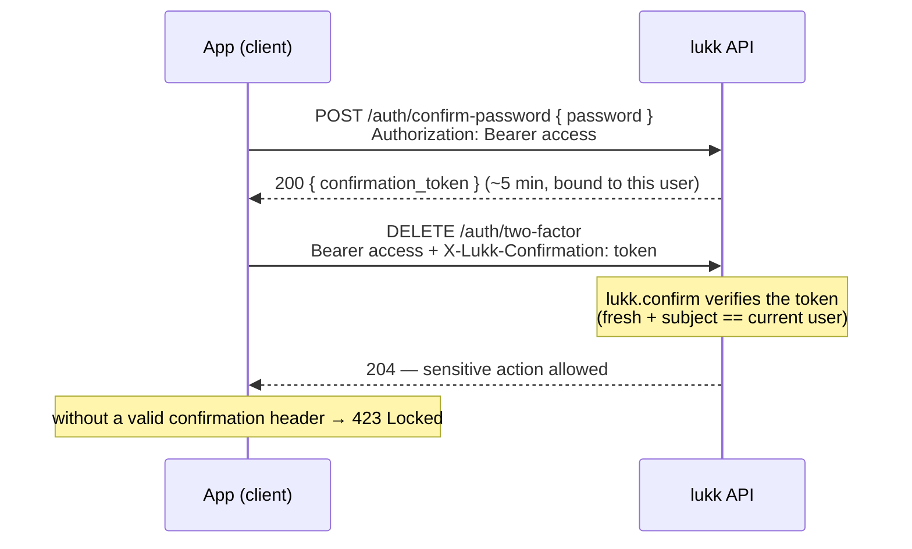
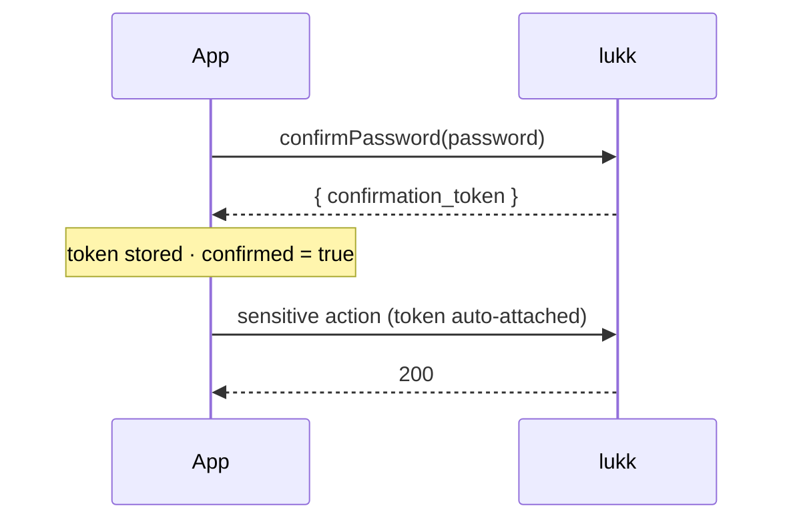

# Confirmation (Sudo Mode)

Some actions are sensitive enough that a valid session isn't sufficient — changing 2FA, managing passkeys, deleting an account — you want proof that the *person* is still there. lukk provides **step-up confirmation**: a short-lived "sudo" window, modeled on GitHub's, that the user enters by re-confirming a credential (a password or a passkey). Sensitive routes then require that proof. The server issues and verifies the token; the client's `useLukkConfirmation` earns it and auto-attaches the header.

> [!NOTE]
> The client earns the token and auto-attaches the header, so gated actions just work.

## Server (Laravel)

### How it works

1. The user re-confirms with a **password** or a **passkey** and receives a short-lived `confirmation_token`.
2. The client sends that token in a request header (default `X-Lukk-Confirmation`) on subsequent sensitive requests.
3. The `lukk.confirm` middleware checks for a valid, fresh token. If it is missing or expired, the route returns **423 Locked**.

The window length is `confirm.ttl` (default 5 minutes). lukk's own [two-factor](/two-factor-authentication) and [passkey](/passkeys) management routes are protected this way.



### Earning confirmation

#### With a password

```http
POST /auth/confirm-password
Authorization: Bearer <access token>
Content-Type: application/json

{ "password": "secret" }
```

```json
{ "confirmation_token": "..." }
```

#### With a passkey

If [passkeys](/passkeys) are enabled, a passkey assertion earns the same token, so passkey-only users can step up too:

```http
POST /auth/confirm-passkey
Authorization: Bearer <access token>
```

Both endpoints return the same kind of `confirmation_token` — the credential used is interchangeable.

### Gating your own routes

Apply the `lukk.confirm` middleware to any route that should require a fresh confirmation — account deletion, an email change, revealing an API key, and so on:

```php
Route::delete('/account', [AccountController::class, 'destroy'])
    ->middleware(['auth:api', 'lukk.confirm']);
```

The client then attaches the confirmation token to the request:

```http
DELETE /account
Authorization: Bearer <access token>
X-Lukk-Confirmation: <confirmation token>
```

A request that reaches a gated route without a valid, fresh token receives `423 Locked`. Your front-end should respond to a `423` by prompting the user to re-confirm, then retrying.

### Configuration

```php
// config/lukk.php
'confirm' => [
    'ttl' => (int) env('LUKK_CONFIRM_TTL', 300),
    'header' => env('LUKK_CONFIRM_HEADER', 'X-Lukk-Confirmation'),
],
```

| Key | Default | Description |
|---|---|---|
| `ttl` | `300` (5 min) | How long a confirmation token remains valid. |
| `header` | `X-Lukk-Confirmation` | The header the middleware reads the token from. |

## Client (Nuxt)

`useLukkConfirmation` is the client for lukk's server-side step-up: the user re-proves their identity, and for a short window afterwards the sensitive routes open up.

### `useLukkConfirmation`

```ts
const {
  confirmed,        // ComputedRef<boolean> — is a confirmation currently held?
  required,         // Ref<boolean> — a withConfirmation() action is waiting on your modal
  token,            // Ref<string | null>
  confirmPassword,  // (password) => Promise<void>
  withConfirmation, // <T>(action: () => Promise<T>) => Promise<T> — per-action modal flow
  cancel,           // () => void — abort a pending withConfirmation
  clear,            // () => void
} = useLukkConfirmation()
```

### How it works

When you confirm, the token is **automatically attached** in the `X-Lukk-Confirmation` header on every subsequent request — so once `confirmed` is `true`, the gated actions simply work, until the window expires server-side (lukk's [`confirm.ttl`](#configuration)). You never thread the token through your own calls.

Where the token lives depends on the [mode](/transport-modes):

- **`direct`** — the token is stored in client state and the client attaches the header.
- **`bff`** — the proxy strips the token from the response and **holds it server-side**, injecting the header itself. The browser only sees `confirmed` flip to `true`; it never holds the confirmation credential.



You never thread the token through your own calls — earning it is the only step.

### Confirming with a password

```ts
const { confirmPassword, confirmed } = useLukkConfirmation()

await confirmPassword(currentPassword)
// confirmed.value === true
```

A wrong password throws a typed [`LukkError`](/lukk-core#errors). Call `clear()` to drop the confirmation early (it also clears on [logout](/authentication#logout)).

### Confirming with a passkey

A passkey can satisfy step-up too — see [Passkeys → Step-up with a passkey](/passkeys#step-up-with-a-passkey):

```ts
const { confirm } = useLukkPasskeys()
await confirm() // stores the confirmation token, same as confirmPassword
```

### Gating: per-action or per-page

These actions require a held confirmation; without one, lukk responds `423 Locked`:

- [Managing 2FA](/two-factor-authentication#managing-2fa) — enable, confirm, disable, regenerate recovery codes
- [Registering or removing a passkey](/passkeys#managing-passkeys)

Two shapes, both supported.

#### Per-action (a modal)

Wrap the sensitive call in `withConfirmation()`. It runs the action and, on a `423`, opens your modal (`required`), waits for a fresh confirmation, and retries once:

```ts
const { withConfirmation } = useLukkConfirmation()
const api = useLukkFetch()

async function deleteAccount() {
  await withConfirmation(() => api('/account', { method: 'DELETE' }))
}
```

Bind a global step-up modal to `required` — the user confirms (password **or** passkey), and the pending action retries automatically:

```vue
<script setup lang="ts">
const { required, confirmPassword, cancel } = useLukkConfirmation()
const password = ref('')
</script>

<template>
  <dialog :open="required">
    <input v-model="password" type="password" >
    <button @click="confirmPassword(password)">Confirm</button>
    <button @click="cancel">Cancel</button>
  </dialog>
</template>
```

`withConfirmation` drops a stale confirmation on the `423`, so it always re-prompts when the server genuinely requires one (rather than trusting an expired client flag). `cancel()` rejects the pending action.

#### Per-page (a section)

To gate a whole page/section instead, use the [`lukk-confirmed`](/authentication#route-middleware) route middleware — stack it after `lukk-auth`; it sends an unconfirmed user to `/confirm-password`:

```ts
definePageMeta({ middleware: ['lukk-auth', 'lukk-confirmed'] })
```

Confirmation is client-session state, so a hard reload re-confirms. The server's `lukk.confirm` (423) is the real enforcement either way — these client guards are UX.

Next: **[useLukkFetch](/use-lukk-fetch)**
