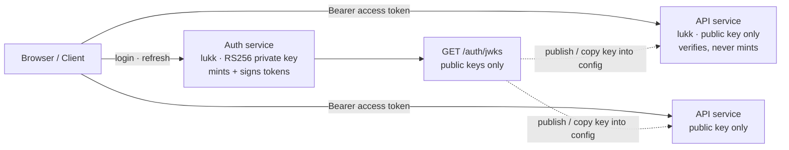

# Deployment

lukk is built for a single first-party service that issues *and* verifies its own tokens. That's the default, and most apps never need anything else. But you can also split login off from your API, mint one token for several services, or hand a public key to an independent verifier. This page covers those topologies and the operational requirements they all share.

Everything here is server-side. The client's production concerns — the BFF session secret and throttling behind a proxy — are at the [bottom of this page](#client-nuxt-in-production).

## Server (Laravel)

### Single service (default)

One Laravel app mints tokens at `/auth/login` and verifies them on every protected request. Issuer and audience are the same thing — your API — so they share a value:

```dotenv
LUKK_ISSUER=https://api.example.com
LUKK_AUDIENCE=https://api.example.com
```

Nothing else to configure. A browser SPA or a BFF in front of this API is **not** a verifier — it only holds and forwards the token — so it needs no lukk configuration of its own.

#### Same origin (front-end + API on one domain)

The simplest — and most common — setup: one domain (say `example.com`) serves the front-end **and** lukk's `/auth/*` and protected routes. Issuer and audience are just that domain:

```dotenv
LUKK_ISSUER=https://example.com
LUKK_AUDIENCE=https://example.com
LUKK_COOKIE_MODE=true
```

This is *less* work than the split sub-domain case, not more:

- **Cookie mode fits a direct browser SPA.** The refresh token rides in the `__Host-refresh` cookie (sent automatically on every same-origin request); the access token stays in memory and goes out as a `Bearer` header. (If you have a server-rendered/BFF layer, leave `cookie_mode` off and use [BFF mode](/transport-modes#bff) instead.)
- **No CORS.** Same origin means no preflight and no credentialed-CORS config — the cross-origin operational note below simply doesn't apply.
- **CSRF is covered by design.** The refresh cookie is `SameSite=Strict` (a cross-site page can't trigger a refresh with it) and protected routes authenticate via the `Bearer` header, not an ambient cookie.
- **Passkeys are the easy case:** `rp_id = example.com`, `origins = ["https://example.com"]` — front-end and API share the exact origin.

lukk's own `/auth/*` routes always render JSON errors (it forces JSON on them); if the same app also serves web routes, your *own* `auth:api` routes need the same — see [Installation](/installation#wire-the-guard).

### Splitting auth and API

You can run a dedicated **auth service** (login, refresh, logout, 2FA, passkeys) and one or more **API services** that only verify tokens. This works today, with no code changes, as long as the services trust each other — see the [caveat](#a-note-on-trust) below. A browser client calling these services across origins uses the lukk-js [direct transport mode](/transport-modes#direct).

**On the auth service** — the default setup. It keeps the routes, the database, and the refresh-token rotation.

**On each API service** — install lukk and configure it as verify-only:

```php
// config/lukk.php
'routes' => false,           // this service doesn't expose login/refresh/logout
```

```dotenv
LUKK_SECRET=…                 # the SAME secret as the auth service
LUKK_ISSUER=https://api.example.com
LUKK_AUDIENCE=https://api.example.com
```

Then map the guard ([Installation](/installation#wire-the-guard)) and protect routes with `auth:api` as usual. An API service needs **no database** — no `refresh_tokens`, 2FA, or passkey tables — because it never mints or rotates anything. It only verifies the access token and resolves the user.

> [!IMPORTANT]
> Point every service at a **shared denylist cache** (`denylist_store` → a Redis all of them reach). That's how a logout or a reuse-revocation on the auth service immediately stops tokens on the API services. Without it, a revoked token still works on an API service until it expires — bounded by `access_ttl` (15 minutes by default), but not instant.

> [!WARNING]
> **A note on trust.** With the default **HS256** algorithm, verifying a token requires the **same secret** that signs it — so every verifying service holds the signing key and could, in principle, mint tokens too. That's fine when the services are all yours and equally trusted. If a verifier must *not* be able to mint (a different trust domain, or least-privilege isolation), use [asymmetric keys](#asymmetric-keys) instead.

### Multiple services (audiences)

The `aud` claim says who a token is *for*. `LUKK_AUDIENCE` is comma-separated, so the **auth service** that mints the token lists every service it's for:

```dotenv
# on the auth service — mint one token for both
LUKK_AUDIENCE=https://api.example.com,https://billing.example.com
```

Each service sets **its own** audience and accepts the token when it's in the list:

```dotenv
# on the billing service
LUKK_AUDIENCE=https://billing.example.com
```

So a service's `LUKK_AUDIENCE` is exactly the set of audiences it accepts. A service whose audience isn't listed rejects the token — this is what stops a token meant for one service from being replayed against another. A single-audience token (the default) stays a plain string; only multi-audience tokens become an array.

### Asymmetric keys (RS256 / ES256) {#asymmetric-keys}

When a verifier must be able to *check* tokens but never *mint* them — a separate trust domain, or least-privilege isolation — a shared symmetric secret is the wrong tool. You want the verifier to hold only a **public** key, which means **RS256/ES256 + a JWKS endpoint**.

This is built in. Generate a signing keypair on the auth service:

```bash
php artisan lukk:keygen
```

Set the algorithm and point lukk at the keypair:

```dotenv
LUKK_ALGORITHM=RS256          # or ES256
```

The auth service now exposes `GET /auth/jwks` — a cacheable JWK Set of **public keys only**. Each verify-only API runs the same algorithm with just the **public** key in its `keys.public` and no private key, so it can validate tokens but never sign them:

```dotenv
# on each verify-only API service
LUKK_ALGORITHM=RS256          # match the auth service
# keys.public holds the public key only — no private key
```

A lukk verifier reads that public key from its own config; it does **not** fetch a remote JWKS. The `/auth/jwks` endpoint is where you *publish* the key — copy it into the verify-only service's config, or point a non-lukk consumer (an API gateway, another framework) at the URL. Keys are addressed by `kid`, so you can rotate the signing key without forcing logouts: publish the new key alongside the old, migrate signing, then retire the old `kid` once its tokens have expired.

The alg is pinned from config and is **never** read from the token header — the alg-confusion defense. See [Configuration](/configuration) for the key settings and [Architecture](/architecture) for the design rationale.



### Pruning expired tokens

Expired and revoked refresh-token rows accumulate over time. The `lukk:prune` command deletes them:

```bash
php artisan lukk:prune
```

The package schedules this command to run **daily by default**. To take over scheduling, opt out from a service provider's `boot` method and register your own cadence:

```php
use Illuminate\Support\Facades\Schedule;
use Lukk\Lukk;

public function boot(): void
{
    Lukk::disableScheduling();

    Schedule::command('lukk:prune')->hourly();
}
```

Only the auth service (the one holding the `refresh_tokens` table) prunes; verify-only API services have no database to prune.

### Operational requirements

A few environment concerns that the package can't enforce for you but depends on:

- **HTTPS everywhere.** Access tokens are bearer credentials and refresh cookies are `Secure` — serve every issuing and verifying route over TLS. The hardened `__Host-` cookies lukk sets are only accepted by browsers over HTTPS. (Running plain HTTP locally has its own caveats — see [Local Development](/local-development).)
- **Trusted proxies.** Every rate limit (login, refresh, passkeys, 2FA) keys on `$request->ip()`. Behind a load balancer or reverse proxy you **must** configure Laravel's `TrustProxies` to your actual proxy IPs. If it trusts arbitrary clients, an attacker spoofs `X-Forwarded-For` to mint a fresh throttle bucket per request and defeats all rate limiting.
- **Throttling behind a BFF.** A back-end-for-frontend (e.g. `lukk-nuxt` in BFF mode) sends *every* user's auth traffic from the BFF server's single IP, so the per-IP login/refresh/2FA/passkey limits collapse onto one bucket for your whole user base. Either raise those limits substantially for a BFF deployment, or have the BFF forward `X-Forwarded-For` (with `TrustProxies` set) so lukk throttles per real client.
- **Shared revocation store.** The denylist, the TOTP replay cache, and the passkey/2FA throttles all live in the cache (`denylist_store`). Across multiple nodes this **must** be a shared, persistent store (e.g. Redis) — never the `array` driver and never a per-node cache, or a revoked token can still be accepted on another node and replay protection isn't authoritative.
- **CSRF in cookie mode.** The refresh cookie is `SameSite=Strict` (set by lukk). If your front-end is on a different site from the API, also ensure CORS is locked to the exact front-end origin with credentials — never `Access-Control-Allow-Origin: *` with `supports_credentials`.
- **JSON error responses.** lukk's `/auth/*` routes return `401`/`422` JSON on their own (it forces `Accept: application/json`), immune to your exception config. Your *own* `auth:api` routes are not — attach the `lukk.force-json` middleware (`Route::middleware(['lukk.force-json', 'auth:api'])`) or see [Installation](/installation#wire-the-guard) for the alternatives (don't rely on `shouldRenderJsonWhen` alone; it doesn't cover the guest redirect).

Run through the full [security checklist](/security) before you ship.

## Client (Nuxt) in production

The client is mostly configuration you set once ([Installation](/installation), [Configuration](/configuration)); two things matter specifically at deploy time, both in **BFF mode**:

- **The session secret must be identical across every instance.** `NUXT_LUKK_SESSION_PASSWORD` is the confidentiality boundary for the sealed session cookie — the BFF equivalent of `APP_KEY`. A load-balanced deploy with per-instance secrets silently invalidates sessions, and rotating it logs everyone out. See [Configuration → the session password](/configuration).
- **Throttling collapses onto the BFF's IP.** Every user's auth traffic egresses from the BFF server, so lukk's per-IP throttles see one address — raise the limits or forward `X-Forwarded-For` (this mirrors the server note above). Keep lukk's `grace_seconds > 0` so the proxy's single-flight refresh never trips a false family revocation.

In `direct` mode there's nothing server-side to run, so neither concern applies — it's the only option for a fully static (SSG) deploy. See [Transport Modes](/transport-modes) for the trade-off, and [Local Development](/local-development) for the HTTPS-cookie caveat when running the client locally.

Next: **[Local Development](/local-development)**
