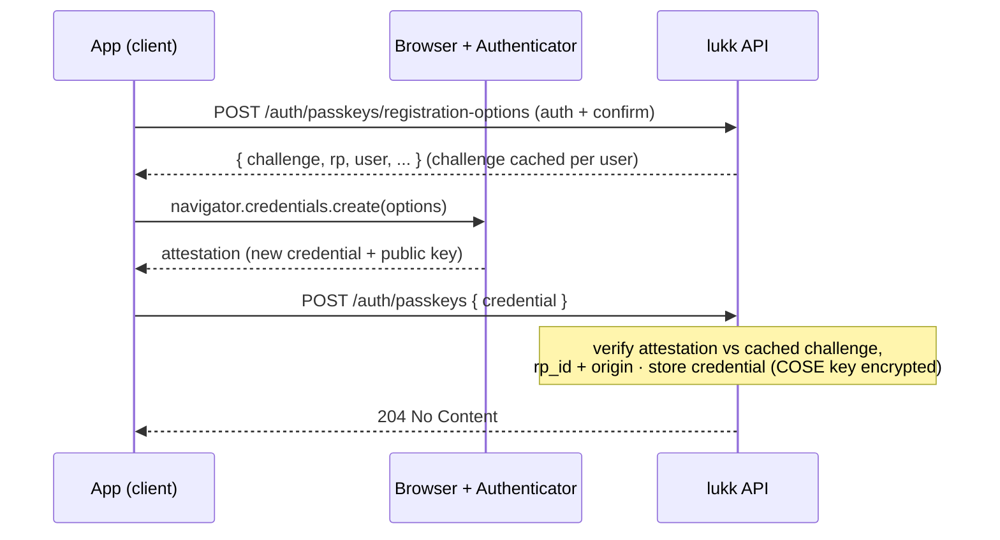
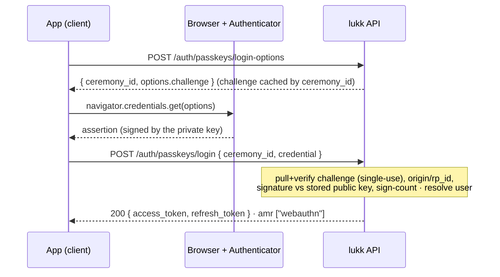
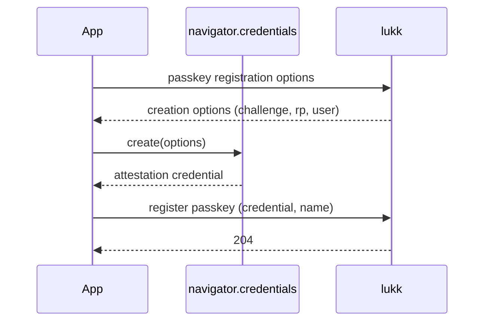

# Passkeys

lukk supports passkeys (WebAuthn / FIDO2) for **passwordless, phishing-resistant** login. A passkey is a public-key credential bound to your domain and stored on the user's device or password manager; logging in proves possession of the private key, which a phishing site can never obtain. The server owns the relying-party config, the challenges, and the credential store; the client's `useLukkPasskeys` drives the browser `navigator.credentials` ceremony.

> [!NOTE]
> Passkeys must be enabled on the server (`features.passkeys`, plus an `rp_id` and `origins`). WebAuthn requires a secure context (HTTPS, or `localhost`).

## Server (Laravel)

### Setup

Install the WebAuthn library (the default ceremony adapter wraps it), publish and run the migration, enable the feature, and set your relying-party configuration:

```bash
composer require web-auth/webauthn-lib
php artisan vendor:publish --tag=lukk-passkey-migrations
php artisan migrate
```

```php
// config/lukk.php
'features' => [
    'passkeys' => true,
    // ...
],

'passkeys' => [
    'rp_id' => 'example.com',                  // registrable domain shared by app + api
    'origins' => ['https://app.example.com'],  // your front-end origin(s)
],
```

See [Configuration → Passkeys](/configuration#passkeys) for every option.

> [!NOTE]
> The default adapter, `Passkeys\SpomkyWebAuthnCeremony`, works out of the box. To use a different WebAuthn library, rebind `Contracts\WebAuthnCeremony`.

### Endpoints

These routes are registered only when `features.passkeys` is enabled.

| Method | Path | Middleware | Purpose |
|---|---|---|---|
| `POST` | `/auth/passkeys/registration-options` | `auth` + confirm | Get a registration challenge. |
| `POST` | `/auth/passkeys` | `auth` + confirm | Verify the attestation and store the credential. |
| `POST` | `/auth/passkeys/login-options` | `throttle` | Get an assertion challenge → `{ ceremony_id, options }`. |
| `POST` | `/auth/passkeys/login` | `throttle` | Verify the assertion → token pair (`amr: ["webauthn"]`). |
| `POST` | `/auth/confirm-passkey` | `auth` | Satisfy [step-up confirmation](/confirmation) with a passkey. |
| `GET` | `/auth/passkeys` | `auth` | List the user's credentials. |
| `DELETE` | `/auth/passkeys/{id}` | `auth` + confirm | Revoke a credential. |

### Registering a passkey

Registration happens while the user is logged in (and has [confirmed](/confirmation) their identity):

1. The client requests options from `/auth/passkeys/registration-options` and passes them to the browser's `navigator.credentials.create()`.
2. The browser returns an attestation, which the client posts to `/auth/passkeys`. lukk verifies it and stores the credential.



### Logging in with a passkey

Login is fully passwordless:

1. The client requests options from `/auth/passkeys/login-options`. The response includes an opaque `ceremony_id` and the WebAuthn `options`; pass the options to `navigator.credentials.get()`.
2. The browser returns an assertion, which the client posts to `/auth/passkeys/login` along with the `ceremony_id`. lukk verifies the signature and returns the normal [token pair](/authentication#logging-in), carrying `amr: ["webauthn"]`.



The challenge is server-generated, single-use, and held server-side (in the cache) — it never travels inside a JWT.

### Managing passkeys

`GET /auth/passkeys` lists the current user's credentials, and `DELETE /auth/passkeys/{id}` revokes one (behind step-up confirmation).

### Split-domain (BFF) deployments

When your front-end and API live on different subdomains (`app.example.com` and `api.example.com`), set:

- **`rp_id`** to the registrable domain they share — `example.com`, **not** `api.example.com`.
- **`origins`** to include the front-end origin — `https://app.example.com` — because the browser reports the front-end's origin, not the API's.

### Security notes

- Credential IDs are globally unique, and the COSE public key is **encrypted at rest**.
- A regressing signature counter is rejected and dispatches `Events\PasskeyCloneDetected`, but a `0` counter is never flagged — synced passkeys (iCloud, Google, 1Password) always report `0`.
- `rp_id` and `origins` are **required** when passkeys are enabled — lukk throws on an empty value rather than fall back to a weak default.
- By default lukk **requires user verification** (`user_verification` → `required`) — the authenticator must verify the user (biometric/PIN), not just their presence. Passwordless login and `confirm-passkey` step-up are single-factor (possession), so enforcing UV makes them phishing-resistant, AAL2-style. Lower it to `preferred` only if you must support authenticators that can't verify the user (see [Configuration](/configuration#passkeys)).
- Passkey storage sits behind `Contracts\PasskeyRepository` (`passkeys` table) and is swappable.

> [!WARNING]
> Passkeys are only as phishing-resistant as your weakest fallback. In lukk's default model, password login is always available — so deleting all passkeys can never lock a user out. For a **passwordless-only** deployment, guard the last credential at your application layer and ensure any recovery path is itself phishing-resistant; otherwise an attacker can downgrade to the weaker method.

## Client (Nuxt)

`useLukkPasskeys` drives the browser ceremony (`navigator.credentials`) and the base64url (de)serialization for you — you just `await` a verb.

> [!IMPORTANT]
> Passkeys are phishing-resistant only because the authenticator binds each assertion to the **browser-facing origin**. Set lukk's `rp_id` to your app's registrable domain and `origins` to the exact origin in the address bar — **not** the lukk API host. In BFF mode the browser talks to your app, so the RP is your app's origin, even though the API lives elsewhere. Avoid wildcard origins. See [Split-domain (BFF) deployments](#split-domain-bff-deployments) above for setting `rp_id`/`origins` on the server.

### `useLukkPasskeys`

```ts
const {
  register, // (name?) => Promise<void>
  login,    // () => Promise<void>   — passwordless, then loads the user
  confirm,  // () => Promise<void>   — step-up via passkey
  list,     // () => Promise<{ passkeys: PasskeySummary[] }>
  remove,   // (credentialId) => Promise<void>
} = useLukkPasskeys()
```

### Registering a passkey

Registration is a sensitive action, so it sits behind [step-up confirmation](/confirmation). Confirm first, then register:



```ts
const { confirmPassword } = useLukkConfirmation()
const { register } = useLukkPasskeys()

await confirmPassword(currentPassword) // step up
await register('My MacBook')           // name is optional
```

The browser prompts the user to create the passkey; `register` handles the options, the ceremony, and posting the result to lukk.

### Passwordless login

`login()` runs the assertion ceremony and, on success, persists the tokens and loads the user — no email or password:

```vue
<script setup lang="ts">
const { login } = useLukkPasskeys()

async function signInWithPasskey() {
  await login()
  await navigateTo('/dashboard')
}
</script>
```

A user can register a passkey on one device and sign in with it on another (synced passkeys "just work" — lukk never flags a zero sign-count).

### Managing passkeys

List the user's passkeys for a settings screen, and remove one by its credential id:

```ts
const { list, remove } = useLukkPasskeys()

const { passkeys } = await list()
// passkeys: { id, name, last_used_at }[] — never the key material

await remove(passkeys[0].id)
```

> [!NOTE]
> Removing a passkey is a sensitive action and is gated behind [confirmation](/confirmation) on the lukk side.

### Step-up with a passkey

A user can also satisfy [step-up confirmation](/confirmation) with a passkey instead of their password — convenient, and phishing-resistant:

```ts
const { confirm } = useLukkPasskeys()
await confirm() // runs an assertion → stores a confirmation token
```

After `confirm()`, the next sensitive action (managing 2FA, registering another passkey) is authorized, exactly as if they'd re-entered their password. See [Confirmation](/confirmation).

Next: **[Email Verification](/email-verification)**
