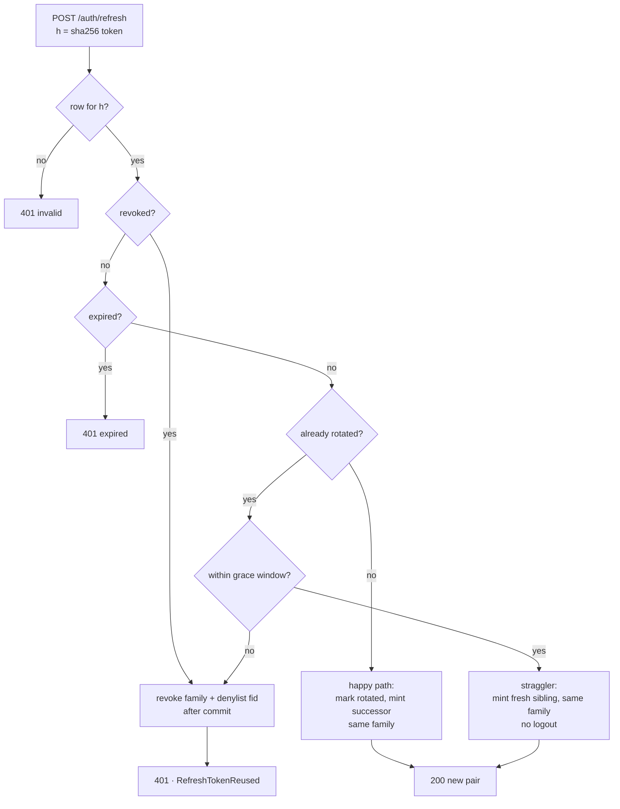

# Tokens & Rotation

This is the deep dive on lukk's two tokens: what the access JWT contains and how it's verified, and how refresh tokens rotate, detect reuse, and get revoked. It's server-centric — lukk mints and validates the tokens — with notes on how the client experiences each mechanism. For where the tokens physically live in the browser, see [Transport Modes](/transport-modes); for the request-lifecycle overview, [How It Works](/how-it-works).

## The access token

The access token is an HS256 JWT, valid for 15 minutes. It carries these claims, with the header `typ=at+jwt`:

| Claim | Meaning |
|---|---|
| `iss` | Issuer — your API's configured URL. |
| `aud` | Audience — the API the token is bound to. |
| `sub` | Subject — the authenticated user's id. |
| `fid` | Refresh **family** id — ties the access token to its refresh-token lineage, so a family revoke can kill it. |
| `jti` | Unique token id — the denylist key for this individual token. |
| `iat` / `nbf` / `exp` | Issued-at / not-before / expiry. |

It's **stateless**: the guard verifies it by checking a signature and these claims, with no database lookup for the token itself.

### Algorithm pinning

On every request the signing algorithm is **pinned from config and never read from the token header**. This is the defense against the classic `alg` confusion attacks — an attacker can't downgrade to `alg=none`, and (under asymmetric keys) can't present an HS256 token signed with the public key as the HMAC secret. Alg mismatches are rejected outright. The JWS layer itself is delegated entirely to the audited `firebase/php-jwt`; lukk never hand-rolls encode/verify.

### Claim validation

Every request asserts the security-relevant claims:

- `iss` and `aud` must match your configuration — a token minted for another service won't verify.
- `exp` is required and enforced; `nbf`/`iat` are honored when present.
- The `typ=at+jwt` header is **stamped and asserted** — a 2FA/step-up *challenge* token (same key, `iss`, and `aud`) is therefore rejected when presented as a bearer.
- The denylist is checked by both `jti` and `fid`, so a single revoked token or a whole revoked session is caught.

### HS256 by default

HS256 (a shared secret) is the correct default while your application is the only thing verifying its own tokens — there's no keypair to distribute and no JWKS to publish. RS256/ES256 + a JWKS endpoint + `kid` key rotation are implemented behind the same contracts for the day an independent service must verify your tokens without holding the signing secret; it's a configuration change (`php artisan lukk:keygen`, flip `LUKK_ALGORITHM`), not a rewrite. See [Deployment → Asymmetric keys](/deployment#asymmetric-keys).

## The refresh token

The refresh token is an opaque, 256-bit random string, valid for 30 days. It's **not** a JWT and carries no readable claims. It's returned to the client once and stored server-side **only as a `sha256` hash** — never logged, never serialized into any client bundle, never JS-readable. Its sole purpose is to obtain a new access token when the old one expires.

Every refresh token belongs to a **family** (`family_id`) that stays stable across a rotation chain. That family id is what links a refresh lineage to the access tokens minted from it (via the `fid` claim), and it's the unit of revocation.

## Rotation

Refresh is atomic and reuse-detecting. In pseudocode:

```
POST /auth/refresh (opaque refresh token RT):
  h = sha256(RT)
  in a transaction:
    row = SELECT ... WHERE token_hash = h FOR UPDATE
    if no row              -> 401 invalid
    if row.revoked_at      -> revoke family; 401   (a killed token was replayed)
    if row.expires_at past -> 401 expired
    if row.rotated_at:
        if within grace    -> mint a fresh successor sibling, same family (a straggler; no logout)
        else               -> revoke family; 401   (post-grace replay = theft)
    # happy path:
    mark row rotated; insert successor in the same family
  mint a new access token
  return { access, refresh, expires_in }
```



The family is revoked **after** the transaction commits, never inside it — revoking inside the transaction and then throwing would roll back the revocation while the denylist cache write persisted, leaving an inconsistent state.

## Reuse detection

Rotation alone isn't the point; reuse detection is what makes it worth doing. When a token that has **already been consumed** (or already revoked) is presented after the grace window, that's the signature of a stolen token being replayed — so lukk revokes the **entire family** and denylists it by `fid`, killing every live access token for that session within one `access_ttl`. It also dispatches [`RefreshTokenReused`](/events) so you can alert on it.

## The grace window

The **grace window** (`grace_seconds`, default 30s) is the counterweight that prevents false positives. Legitimate concurrent refreshes — multiple tabs, SSR + hydration — present the same token nearly simultaneously; within the window the older one is served a fresh access token under the same family rather than being treated as theft.

> [!NOTE]
> **Accepted residual.** The grace window is a deliberate trade-off: a token *stolen and replayed within `grace_seconds` of a legitimate refresh* yields a fresh successor on a sibling chain instead of a family revoke — so that race produces a parallel session reuse-detection won't catch until the thief replays a *consumed* token past grace. This is the price of never falsely logging out a direct (non-BFF) client that can't be single-flighted; keep `grace_seconds` as small as your concurrency tolerates. Watch [`RefreshTokenReused`](/events) for the post-grace replays that *are* caught.

### How the client experiences it

The client never asks you to manage any of this. On a `401` it calls refresh once and retries the original request, and concurrent 401s are collapsed into a **single in-flight refresh** (`singleFlight`) — a page firing ten requests at once triggers one refresh, not ten. In BFF mode the proxy single-flights its server-side refresh per session for the same reason. Both dovetail with the grace window above, so a rotated refresh token is never replayed into a false family revocation. See [Transport Modes](/transport-modes) for the per-mode details.

## The denylist and revocation

Because the denylist is consulted on every request, revocation is instant. It's held in the **cache, not a table** — keyed by `jti` and `fid`, with each entry self-evicting when the token it revokes would have expired anyway. That makes revocation O(revoked sessions) rather than O(all tokens). A logout revokes one session; `DELETE /auth/sessions` revokes them all.

## Database schema

```php
Schema::create('refresh_tokens', function (Blueprint $table) {
    $table->ulid('id')->primary();
    $table->foreignId('user_id')->index();
    $table->uuid('family_id')->index();          // stable across a rotation chain
    $table->char('token_hash', 64)->unique();    // sha256(opaque token)
    $table->ulid('previous_id')->nullable();     // audit chain
    $table->timestamp('rotated_at')->nullable(); // set when consumed
    $table->timestamp('revoked_at')->nullable(); // hard kill (logout / reuse cascade)
    $table->timestamp('expires_at')->index();
    $table->timestamps();
});
```

Next: **[Transport Modes](/transport-modes)**
