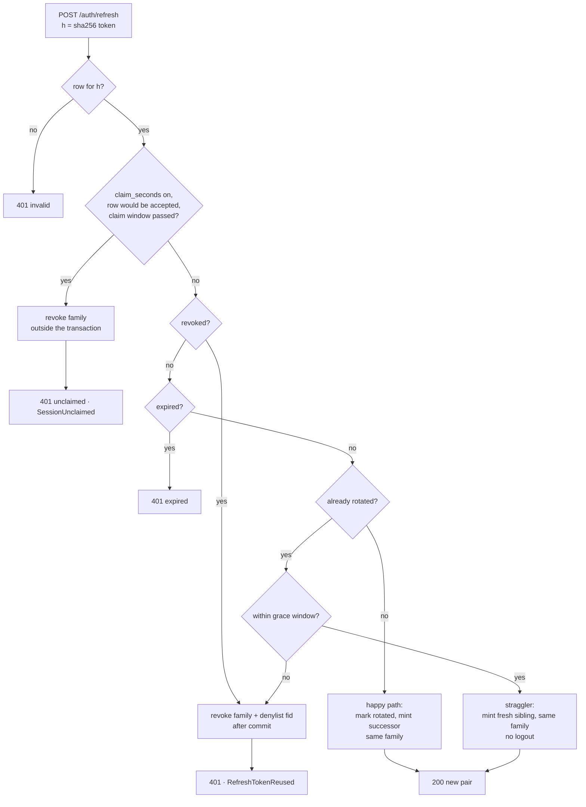

# Tokens & Rotation

This is the deep dive on lukk's two tokens: what the access JWT contains and how it's verified, and how refresh tokens rotate, detect reuse, and get revoked. It's server-centric — lukk mints and validates the tokens — with notes on how the client experiences each mechanism. For where the tokens physically live in the browser, see [Transport Modes](/transport-modes); for the request-lifecycle overview, [How It Works](/how-it-works).

## The access token

The access token is an HS256 JWT, valid for 15 minutes. It carries these claims, with the header `typ=at+jwt`:

| Claim | Meaning |
|---|---|
| `iss` | Issuer — your API's configured URL. |
| `aud` | Audience — the API the token is bound to. |
| `sub` | Subject — the authenticated user's id. |
| `fid` | Refresh **family** id — ties the access token to its refresh-token lineage, so a family revoke can kill it. |
| `jti` | Unique token id — the denylist key for this individual token. |
| `iat` / `nbf` / `exp` | Issued-at / not-before / expiry. |

It's **stateless**: the guard verifies it by checking a signature and these claims, with no database lookup for the token itself.

### Algorithm pinning

On every request the signing algorithm is **pinned from config and never read from the token header**. This is the defense against the classic `alg` confusion attacks — an attacker can't downgrade to `alg=none`, and (under asymmetric keys) can't present an HS256 token signed with the public key as the HMAC secret. Alg mismatches are rejected outright. The JWS layer itself is delegated entirely to the audited `firebase/php-jwt`; lukk never hand-rolls encode/verify.

### Claim validation

Every request asserts the security-relevant claims:

- `iss` and `aud` must match your configuration — a token minted for another service won't verify.
- `exp` is required and enforced; `nbf`/`iat` are honored when present.
- The `typ=at+jwt` header is **stamped and asserted** — a 2FA/step-up *challenge* token (same key, `iss`, and `aud`) is therefore rejected when presented as a bearer.
- The denylist is checked by both `jti` and `fid`, so a single revoked token or a whole revoked session is caught.

### HS256 by default

HS256 (a shared secret) is the correct default while your application is the only thing verifying its own tokens — there's no keypair to distribute and no JWKS to publish. RS256/ES256 + a JWKS endpoint + `kid` key rotation are implemented behind the same contracts for the day an independent service must verify your tokens without holding the signing secret; it's a configuration change (`php artisan lukk:keygen`, flip `LUKK_ALGORITHM`), not a rewrite. See [Deployment → Asymmetric keys](/deployment#asymmetric-keys).

## The refresh token

The refresh token is an opaque, 256-bit random string, valid for 30 days. It's **not** a JWT and carries no readable claims. It's returned to the client once and stored server-side **only as a `sha256` hash** — never logged, never serialized into any client bundle, never JS-readable. Its sole purpose is to obtain a new access token when the old one expires.

Every refresh token belongs to a **family** (`family_id`) that stays stable across a rotation chain. That family id is what links a refresh lineage to the access tokens minted from it (via the `fid` claim), and it's the unit of revocation.

## Rotation

Refresh is atomic and reuse-detecting. In pseudocode:

```
POST /auth/refresh (opaque refresh token RT):
  h = sha256(RT)
  row = SELECT ... WHERE token_hash = h        # unlocked pre-read
  if claim_seconds on and the transaction would ACCEPT this row:
      claim the session, or -> 401 unclaimed   (SessionUnclaimed; never RefreshTokenReused)
  resolve abilitiesUsing / tokenClaimsUsing    # no consumer code under the lock
  in a transaction:
    row = SELECT ... WHERE token_hash = h FOR UPDATE
    if no row              -> 401 invalid
    if row.revoked_at      -> revoke family; 401   (a killed token was replayed)
    if row.expires_at past -> 401 expired
    if row.rotated_at:
        if within grace    -> mint a fresh successor sibling, same family (a straggler; no logout)
        else               -> revoke family; 401   (post-grace replay = theft)
    # happy path:
    mark row rotated; insert successor in the same family
  mint a new access token
  return { access, refresh, expires_in }
```

The [`claim_seconds`](/configuration#refresh-behavior) check runs **before** the transaction, and only for a token the transaction would go on to accept — a rejected one isn't a use, and reuse detection has to stay the thing that decides a replay. It is hoisted out for the same reason the `abilitiesUsing` / `tokenClaimsUsing` callbacks are: a cache round trip must not extend the row lock, and the revocation it may perform must run outside a transaction. An unclaimed session answers the same `401` as every other rejection and dispatches [`SessionUnclaimed`](/events#sessionunclaimed) — never `RefreshTokenReused`, because nothing was replayed.


```mermaid
flowchart TD
    A[POST /auth/refresh<br/>h = sha256 token] --> B{row for h?}
    B -- no --> X[401 invalid]
    B -- yes --> N{claim_seconds on,<br/>row would be accepted,<br/>claim window passed?}
    N -- yes --> U[revoke family<br/>outside the transaction] --> V[401 unclaimed · SessionUnclaimed]
    N -- no --> C{revoked?}
    C -- yes --> K[revoke family + denylist fid<br/>after commit] --> R[401 · RefreshTokenReused]
    C -- no --> D{expired?}
    D -- yes --> X2[401 expired]
    D -- no --> E{already rotated?}
    E -- no --> H[happy path:<br/>mark rotated, mint successor<br/>same family] --> P[200 new pair]
    E -- yes --> G{within grace window?}
    G -- yes --> S[straggler:<br/>mint fresh sibling, same family<br/>no logout] --> P
    G -- no --> K
```

The family is revoked **after** the transaction commits, never inside it — revoking inside the transaction and then throwing would roll back the revocation while the denylist cache write persisted, leaving an inconsistent state.

## Reuse detection

Rotation alone isn't the point; reuse detection is what makes it worth doing. When a token that has **already been consumed** (or already revoked) is presented after the grace window, that's the signature of a stolen token being replayed — so lukk revokes the **entire family** and denylists it by `fid`, killing every live access token for that session within one `access_ttl`. It also dispatches [`RefreshTokenReused`](/events) so you can alert on it.

That event fires **only** for a genuine replay. Presenting a token that was already revoked — the ordinary case of a client retrying with one it still held across a logout — still force-revokes the family and still returns `401`, but is not reported as reuse: it isn't evidence of theft, and a steady drip of benign events would bury the alarm that is.

## The grace window

The **grace window** (`grace_seconds`, default 30s) is the counterweight that prevents false positives. Legitimate concurrent refreshes — multiple tabs, SSR + hydration — present the same token nearly simultaneously; within the window the older one is served a fresh access token under the same family rather than being treated as theft.

### A deliberate deviation from the spec

Worth stating plainly, because it is the one place lukk knowingly departs from the standards it otherwise follows.

[RFC 9700 §4.14.2](https://www.rfc-editor.org/rfc/rfc9700) and [OAuth 2.1](https://datatracker.ietf.org/doc/html/draft-ietf-oauth-v2-1) describe rotation identically, and **neither provides for a tolerance window**:

> The previous refresh token is invalidated but information about the relationship is retained by the authorization server. If a refresh token is compromised and subsequently used by both the attacker and the legitimate client, one of them will present an invalidated refresh token, which will inform the authorization server of the breach. […] it will revoke the active refresh token.

Within `grace_seconds`, lukk **detects** that replay and deliberately does **not** revoke — it mints a sibling. Three things bound that choice:

- **It is what the deviation buys.** Strict invalidate-on-replay means any genuinely concurrent refresh — two tabs, an SSR render racing the client — logs the user out. A direct (non-BFF) client can't be forced to single-flight, so this would be a routine false logout, not an edge case.
- **The tolerance is one token deep.** Grace is measured from each token's own `rotated_at`, so only the *immediately previous* token is tolerated; an older one in the chain is already past its window and still trips reuse detection.
- **Every major implementation does the same.** Okta ships a 30-second rotation grace period (configurable 0–60, the same default lukk uses), Auth0 a "rotation overlap period", and fosite a grace period in its refresh grant handler.

**The residual:** a thief who replays *within* `grace_seconds` of a legitimate refresh gets a sibling, and from then on both chains rotate independently — never colliding, so never tripping reuse detection. Keep `grace_seconds` as small as your concurrency tolerates, watch [`RefreshTokenReused`](/events) for the post-grace replays that *are* caught, and watch [`RefreshFamilyForked`](/events) for the fork itself.

### How the client experiences it

The client never asks you to manage any of this. On a `401` it calls refresh once and retries the original request (a sign-in call excepted — its `401` is the answer), and concurrent 401s are collapsed into a **single in-flight refresh** (`singleFlight`) — a page firing ten requests at once triggers one refresh, not ten. In BFF mode the proxy single-flights its server-side refresh per session for the same reason. Both dovetail with the grace window above, so a rotated refresh token is never replayed into a false family revocation. See [Transport Modes](/transport-modes) for the per-mode details.

## The denylist and revocation

Because the denylist is consulted on every request, revocation is instant. It's held in the **cache, not a table** — keyed by `jti` and `fid`, with each entry self-evicting when the token it revokes would have expired anyway. That makes revocation O(revoked sessions) rather than O(all tokens). A logout revokes one session; `DELETE /auth/sessions` revokes them all.

## Database schema

```php
Schema::create('refresh_tokens', function (Blueprint $table) {
    $table->ulid('id')->primary();
    $table->unsignedBigInteger('user_id')->index();
    $table->string('guard')->nullable();         // the guard this family belongs to
    $table->uuid('family_id')->index();          // stable across a rotation chain
    $table->char('token_hash', 64)->unique();    // sha256(opaque token)
    $table->ulid('previous_id')->nullable();     // audit chain
    $table->text('scope')->nullable();           // pinned grant, or null to derive per mint
    $table->timestamp('rotated_at')->nullable(); // set when consumed
    $table->timestamp('revoked_at')->nullable()->index(); // hard kill (logout / reuse cascade)
    $table->timestamp('expires_at')->index();    // absolute family ceiling
    $table->timestamps();
});
```

Three columns are worth a word:

- **`guard`** (lukk 0.4.0) is null on the default guard and carries the guard's name on any other, so [multiple guards](/multiple-guards) can't see, rotate, or revoke each other's families even where `users.id === admins.id`. A single-guard install never reads it.
- **`scope`** (lukk 0.6.0) is the family's pinned [ability](/abilities) grant. `null` and `''` mean different things — *derive on every mint* and *pinned to nothing* — so a replacement [`RefreshTokenRepository`](/customization#swapping-storage) has to round-trip the empty string.
- **`revoked_at` is indexed** because `lukk:prune` sweeps on it. `created_at` (from `timestamps()`) is load-bearing too: it is how [`claim_seconds`](/configuration#refresh-behavior) recognises a session's never-rotated original token.

Change the `user_id` column type if your users have non-integer keys. The migration is [publish-only](/installation), so none of this is applied for you.

Next: **[Transport Modes](/transport-modes)**
