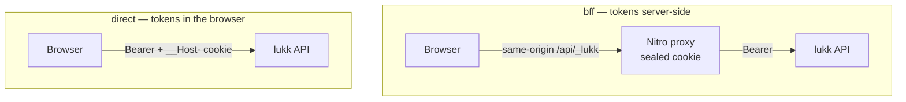
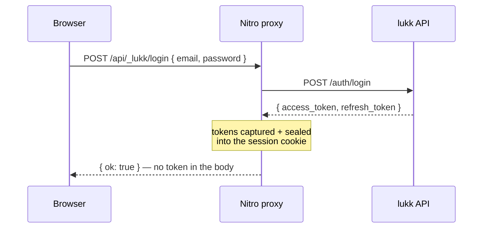

# Transport Modes

The client speaks to lukk in one of two modes. They differ only in **where the tokens live and who talks to lukk** — your component code is identical either way, because both sit behind the same composables. On the server, each client mode pairs with a lukk [output mode](/configuration#output-mode): **`bff` ↔ body mode**, **`direct` ↔ cookie mode**.



## BFF Mode

`mode: 'bff'` (the default). A Nitro server route (`/api/_lukk/**`) proxies every auth call to lukk. The tokens are captured on the server and stored in a **sealed, encrypted cookie** — the browser receives only that opaque session cookie and **never sees a JWT or a refresh token**.



The proxy also refreshes server-side: when a forwarded request comes back `401`, it uses the stored refresh token to mint a new pair, re-seals it, and retries — all without the browser noticing.

The proxy also **holds the step-up confirmation token server-side** (it strips it from confirm responses and injects the `X-Lukk-Confirmation` header itself) — so in BFF mode *no* credential, not even the confirmation token, ever reaches the browser.

**Why choose it**

- The browser holds **no token** (access, refresh, or confirmation), so XSS can't exfiltrate one.
- Clean SSR: the server reads the sealed session and hydrates both the authenticated **data** and the auth **state** (`user` / `loggedIn`), so authenticated pages render logged-in on the first paint — no flash, no `<ClientOnly>` (see [SSR hydration](#ssr-hydration)).
- No CORS — the browser only talks to your own origin.

**The CSRF trade-off.** Moving tokens server-side trades XSS-exfiltration risk for CSRF risk: the proxy is authenticated by the ambient session cookie. lukk-nuxt closes this — the session cookie is `__Host-lukk-session` (`SameSite=Strict; Secure; HttpOnly; Path=/`, no `Domain`), **and** the proxy rejects any state-changing request whose `Origin` doesn't match your app (a `403`). You don't need to add your own CSRF layer for `/api/_lukk/**`.

**What it needs**

- A runtime server (Node, an edge runtime, a serverless function) — so it does **not** work for a fully static (SSG) deploy.
- A session secret, [`NUXT_LUKK_SESSION_PASSWORD`](/configuration#session-password).
- lukk in body mode (`LUKK_COOKIE_MODE=false`, its default), so the proxy receives the refresh token to seal.

> [!NOTE]
> **Throttling & `grace_seconds`.** Every user's auth traffic egresses from the BFF server's IP, so lukk's *per-IP* refresh/login [throttles](/configuration#rate-limits) collapse onto one address — raise them for a BFF deployment (and forward `X-Forwarded-For` to lukk if it sits behind your proxy). Keep lukk's `grace_seconds > 0` (its default 30s): the proxy single-flights refresh, but a zero grace window turns any concurrent refresh into a full-family [revocation](/architecture#reuse-detection).

> [!WARNING]
> **Keep the sealed session under ~4 KB (a claims budget).** The `__Host-lukk-session` cookie holds the access JWT *plus* the refresh and confirmation tokens, iron-sealed (which inflates the payload ~1.34× on top of a fixed envelope). Per [RFC 6265bis §5.6](https://httpwg.org/specs/rfc6265bis.html#section-5.6) a browser **silently drops** any cookie whose `name`+`value` exceeds **4096 octets** — so if a bloated access token pushes the seal over the line, login appears to succeed but the cookie never persists and every following request is anonymous. This only bites when your backend embeds a large claim set via [`Lukk::tokenClaimsUsing`](/customization) (many roles/permissions/tenant data). Keep custom claims lean — put bulky authorization data behind an API lookup keyed by `sub`, not in the token. lukk-nuxt emits a one-line `console.warn` as the sealed session nears the limit so you catch it in development.

### SSR hydration

In BFF mode the server holds the session, so lukk-nuxt hydrates `useLukkAuth().user` / `loggedIn` **during server rendering** — an authenticated page renders logged-in on the first paint, with no logged-out→logged-in flash and no consumer `<ClientOnly>`. It's **on by default**; disable it with `lukk: { ssrHydrate: false }` (reverting to client-only restore).

Per request, on the server, a `session.server` plugin reads the sealed session (read-only — it never mints or slides the cookie), and if the access token is still valid it fetches your `user.endpoint` in-process (the same request-aware path [`useLukkFetch`](/use-lukk-fetch) uses) and seeds the user into the SSR payload. The client then hydrates with `user` already present and skips the redundant restore.

Security properties:

- **No token in the payload.** Only your app `user` resource is serialized into the HTML; the access/refresh token never leaves the server (the BFF invariant holds). Expose only fields you're comfortable shipping in the page from your `user.endpoint`.
- **`no-store` on hydrated renders.** A page that embeds a per-user identity is marked `Cache-Control: no-store`, so a shared cache/CDN can't serve one user's render to another (the sealed cookie header alone does **not** prevent caching — RFC 6265bis §5.6).
- **Fails safe.** An anonymous, tampered, or expired-seal request hydrates as logged-out with no side effects (no minted cookie, no 500). An access token that's *expired at render time* is deferred to the client restore rather than refreshed mid-render (refreshing would rotate + re-seal the session during the document response).
- **`direct` mode is unaffected** — the access token lives in client memory only, so there's no server session to hydrate from; direct-mode pages stay client-hydrated.

> [!NOTE]
> **Additive, but a behavior change from ≤ 0.3.** SSR `useLukkAuth().user` used to be `null` on the server (populated only after client hydration); it is now populated during SSR in BFF mode. If a page special-cased "always anonymous on the server", review it (or set `ssrHydrate: false`).

### Authenticating your own API in BFF

The proxy above authenticates the lukk **`/auth`** routes. Your **own** API (and `user.endpoint`) gets no token automatically — the browser has none. Two supported ways (this pairs with lukk's [splitting auth from the API](/deployment#splitting-auth-and-api) topology when the two live on different services):

1. **The app-API proxy** (recommended) — forward `${path}/**` to a fixed Laravel `target`, injecting the bearer server-side:

   ```ts
   lukk: {
     mode: 'bff',
     api: { path: '/api', target: 'https://api.example.com' },
     user: { endpoint: '/api/me' }, // same-origin → authenticated by the proxy
   }
   ```

   `$fetch('/api/...')` from the browser is now authenticated, the token never leaving the server. SSRF-safe (fixed target), CSRF-checked, strips the inbound cookie/authorization **and any browser-spoofable `X-Forwarded-*` headers** (stamping a trusted client IP so Laravel's per-IP throttling/logging can't be poisoned), strips upstream `Set-Cookie`, marks responses non-cacheable, streams the body, and never proxies `/api/_lukk/**`.

   > [!NOTE]
   > **Transparent refresh.** If the sealed session's access token has already expired, the proxy refreshes it server-side *before* forwarding — sharing the same per-session single-flight as the `/api/_lukk/**` auth proxy, so a concurrent auth call and app-API call rotate the refresh token exactly once (never a reuse-detection family revoke). The rotated session is re-sealed into the cookie and carried through the streamed response. A genuinely revoked session still surfaces naturally: the refresh fails and Laravel sees the (stale) bearer, returning its own `401`. The request body is never buffered.

   > [!NOTE]
   > The trusted IP is the connection peer. If Nitro itself sits behind a load balancer / CDN, that's the LB's IP — configure your trust chain (or have your edge set the real `X-Forwarded-For`) if Laravel needs the true client IP.

2. **Your own server route** — read the token with the auto-imported read-only helper `getLukkAccessToken(event)` (it never sets a cookie, so it's safe on unauthenticated requests):

   ```ts
   export default defineEventHandler(async (event) => {
     const token = await getLukkAccessToken(event)
     if (!token) throw createError({ statusCode: 401 })
     return $fetch('https://api.example.com/me', { headers: { Authorization: `Bearer ${token}` } })
   })
   ```

To call your app API from a page or `useAsyncData`, use the auth-aware [`useLukkFetch`](/use-lukk-fetch) — a plain `$fetch('/api/...')` forwards no cookie during SSR and 401s. For forms bound to Laravel validation, use [`useLukkForm`](/use-lukk-form).

## Direct Mode

`mode: 'direct'`. The client in the browser calls lukk directly — there is no proxy. The access token is kept **in memory** (never in `localStorage`), and the refresh token lives in lukk's hardened `__Host-refresh` cookie (HttpOnly, Secure, `SameSite=Strict`), which the browser sends automatically on refresh.

**Why choose it**

- No runtime server required — it works for a **fully static site** served from a CDN.
- Simpler deploy: there's nothing server-side to run.

**What it needs**

- lukk in cookie mode (`LUKK_COOKIE_MODE=true`), so the refresh token is delivered as the `__Host-` cookie.
- **CORS configured on lukk** for your site's exact origin, with credentials. Because the client sends `credentials: 'include'`, lukk must echo your specific `Origin` and set `Access-Control-Allow-Credentials: true` — a wildcard `Access-Control-Allow-Origin: *` is rejected by the browser when credentials are included. Getting this wrong fails *silently* as a perpetual logged-out loop. (Cross-site cookie delivery also requires lukk's refresh cookie to be `SameSite=None; Secure` if your app and API are on different sites.)

Call your own API with [`useLukkFetch()`](/use-lukk-fetch) here too: it attaches the in-memory bearer and single-flights a `401` refresh-and-retry (sharing `$lukk`'s refresh). Because the token is client-only, a **direct**-mode `useLukkFetch` call during SSR has no bearer — fetch your API on the client, or use **BFF** mode when you need SSR-authenticated data.

> [!WARNING]
> **The access token is reachable by JavaScript in direct mode.** It lives in client memory (never `localStorage`), but any script on the page — including injected script under XSS — can read it and call the API as the user until it expires. Minimise your XSS surface and set a strict Content-Security-Policy. The token is **not** written during SSR, so it never lands in the hydration payload; keep it that way (don't trigger `login`/`fetchUser` server-side). If you need the browser to hold *no* token at all, use **BFF mode**.

> [!NOTE]
> The access token in memory is gone on a full page reload — that's fine. On load, [session restore](/authentication#restore) silently refreshes from the `__Host-` cookie and you're logged back in.

## Which Mode for Which App

| Your app | Recommended mode |
|---|---|
| SSR (Nuxt with a Node/edge server) | **`bff`** |
| SPA served by a Node server | **`bff`** |
| Static site / SSG (CDN, no server) | **`direct`** |
| Prototype hitting a local lukk | either |

When in doubt and you have a server, prefer **`bff`** — keeping tokens out of the browser is the stronger default.

## Switching Modes

Flip one config value — and update the lukk side to match the [output mode](/configuration#output-mode):

```ts
// nuxt.config.ts
lukk: { mode: 'direct' }
```

```dotenv
# lukk (.env) — cookie mode for direct, body mode for bff
LUKK_COOKIE_MODE=true
```

No component, composable, or page changes. That's the point.

> [!NOTE]
> Both modes ride `Secure`, `__Host-`-prefixed cookies that a browser won't persist over plain `http`. For running either mode on `http://localhost`, see [Local Development](/local-development).

Next: **[Configuration](/configuration)**.
