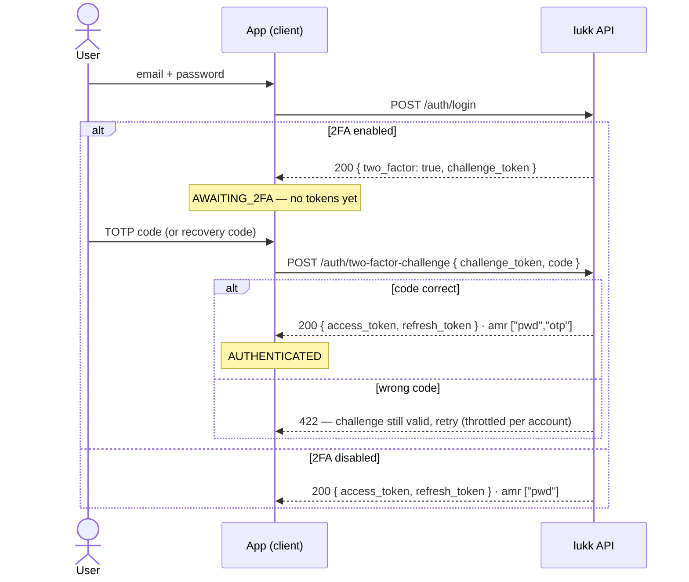
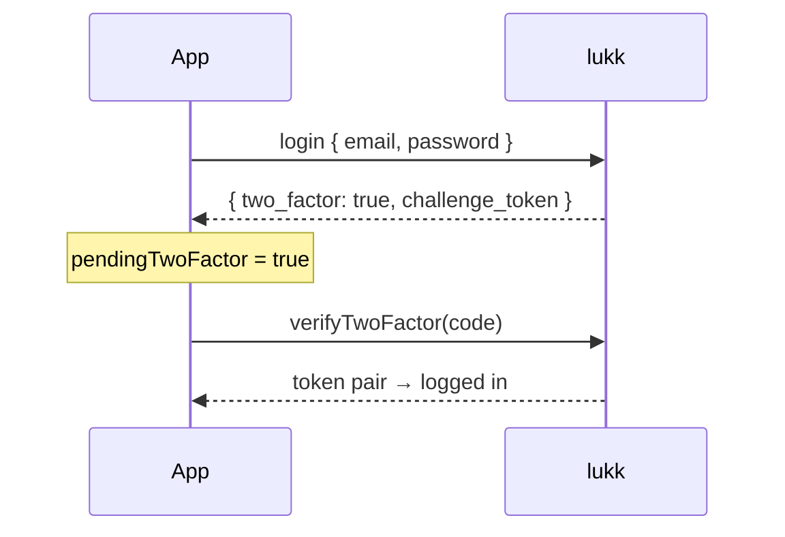

# Two-Factor Authentication

lukk ships optional, opt-in two-factor authentication (2FA) using time-based one-time passwords (TOTP) — the codes generated by apps like Google Authenticator and 1Password — with single-use recovery codes as a backup. The server owns enrolment, the challenge, and replay protection; the client drives the ceremony with `useLukkAuth` (completing a 2FA login) and `useLukkTwoFactor` (managing it).

> [!NOTE]
> 2FA must be enabled and configured on the server (`features.two_factor`). The client is inert without it.

## Server (Laravel)

### Setup

Install the TOTP library, publish and run the migration (it adds columns to your `users` table), and enable the feature:

```bash
composer require pragmarx/google2fa
php artisan vendor:publish --tag=lukk-two-factor-migrations
php artisan migrate
```

```php
// config/lukk.php
'features' => [
    'two_factor' => true,
    // ...
],
```

Add the `HasTwoFactorAuthentication` trait to your `User` model:

```php
use Lukk\Concerns\HasRefreshTokens;
use Lukk\Concerns\HasTwoFactorAuthentication;

class User extends Authenticatable
{
    use HasRefreshTokens;
    use HasTwoFactorAuthentication;
}
```

The trait manages the `two_factor_secret`, `two_factor_recovery_codes`, and `two_factor_confirmed_at` columns. See [Configuration → Two-Factor](/configuration#two-factor) for the available options.

### How it works

2FA uses a two-step enrolment and a two-step login:

- **Enrolment** is `enable` → `confirm`. Enabling provisions a secret and returns the `otpauth://` URI and recovery codes; the user must submit a valid code to `confirm` before 2FA actually activates. This prevents locking a user out with a secret they never successfully scanned.
- **Login** is `login` → `two-factor-challenge`. When a user with confirmed 2FA logs in, the login endpoint returns a short-lived **challenge token** instead of tokens; the client exchanges it, plus a code, for the real token pair.

### Endpoints

These routes are registered only when `features.two_factor` is enabled.

| Method | Path | Middleware | Purpose |
|---|---|---|---|
| `POST` | `/auth/two-factor` | `auth` + confirm | Begin enrolment → `{ otpauth_uri, recovery_codes }` (shown once). |
| `POST` | `/auth/two-factor/confirm` | `auth` + confirm | Activate 2FA after a valid `code`. |
| `GET` | `/auth/two-factor/recovery-codes` | `auth` | How many recovery codes remain (a count — never the codes). |
| `POST` | `/auth/two-factor/recovery-codes` | `auth` + confirm | Regenerate recovery codes. |
| `DELETE` | `/auth/two-factor` | `auth` + confirm | Disable 2FA. |
| `POST` | `/auth/two-factor-challenge` | `throttle` | Exchange a `challenge_token` + `code`/`recovery_code` for a token pair. |

> [!NOTE]
> The management routes (everything except the challenge) are gated by [step-up confirmation](/confirmation) — the user must have recently re-confirmed their identity. Changing someone's 2FA settings should require fresh proof.

### Enrolling a user

1. The user posts to `/auth/two-factor`. The response contains the provisioning URI (render it as a QR code) and the recovery codes (display them once):

   ```json
   {
       "otpauth_uri": "otpauth://totp/Example:taylor@example.com?secret=...",
       "recovery_codes": ["aaaa-bbbb", "cccc-dddd", "..."]
   }
   ```

2. The user scans the QR code with their authenticator app and submits a generated code to `/auth/two-factor/confirm`. 2FA is now active.

### Logging in with 2FA

When a 2FA-enabled user logs in, `/auth/login` returns a challenge rather than tokens:

```json
{ "two_factor": true, "challenge_token": "..." }
```

The client submits the challenge with a TOTP `code` (or a `recovery_code`) to `/auth/two-factor-challenge`:

```http
POST /auth/two-factor-challenge
Content-Type: application/json

{ "challenge_token": "...", "code": "123456" }
```

This returns the normal [token pair](/authentication#logging-in), carrying the claim `amr: ["pwd","otp"]` to record that two factors were used. The challenge is single-use and short-lived; a wrong code leaves it usable so the user can retry, and the endpoint is throttled per account.



### Recovery codes

Recovery codes let a user authenticate if they lose their device. Each code works **once**. Submit one as `recovery_code` (instead of `code`) to `/auth/two-factor-challenge`. Users can regenerate the full set at any time via `/auth/two-factor/recovery-codes`, which invalidates the old codes.

### Security notes

- The TOTP secret is stored **encrypted** (it must be reversible to verify codes), while recovery codes are **salted and hashed** and shown only once.
- A TOTP code cannot be replayed within its 30-second window — accepted codes are cached and rejected on reuse.
- The verification window is ±1 step and should not be widened (see [Configuration](/configuration#two-factor)).

> [!WARNING]
> TOTP is **not phishing-resistant**. A real-time attacker-in-the-middle (such as Evilginx) can relay a code and steal the session. For phishing-resistant authentication, use [passkeys](/passkeys).

## Client (Nuxt)

Two-factor authentication has two halves on the client: **completing a login** when a user has 2FA enabled, and **managing** 2FA (turning it on, off, recovery codes). The first lives on `useLukkAuth`; the second on `useLukkTwoFactor`.

### The login challenge

When a 2FA user logs in, lukk returns a **challenge** instead of tokens. `login` surfaces this by flipping `pendingTwoFactor` to `true` rather than completing — you show a code input and call `verifyTwoFactor`:



```vue
<script setup lang="ts">
const { login, pendingTwoFactor, verifyTwoFactor } = useLukkAuth()

const code = ref('')

async function onLogin() {
  await login({ email: email.value, password: password.value })
  // if pendingTwoFactor is now true, the template shows the code input
}

async function onVerify() {
  await verifyTwoFactor(code.value)
  await navigateTo('/dashboard')
}
</script>

<template>
  <form v-if="pendingTwoFactor" @submit.prevent="onVerify">
    <input v-model="code" inputmode="numeric" autocomplete="one-time-code">
    <button>Verify</button>
  </form>
  <LoginForm v-else @submit="onLogin" />
</template>
```

The pending challenge is held for you; `verifyTwoFactor` completes it, persists the tokens, and loads the user.

### Recovery codes at login

If the user has lost their authenticator, accept a recovery code instead:

```ts
const { verifyRecoveryCode } = useLukkAuth()
await verifyRecoveryCode('a1b2c3d4-...')
```

Recovery codes are single-use; lukk consumes the code as it completes the challenge.

### Managing 2FA

`useLukkTwoFactor` handles enrolment and teardown:

```ts
const {
  enable,                  // () => Promise<{ otpauth_uri, recovery_codes }>
  confirm,                 // (code) => Promise<void>
  disable,                 // () => Promise<void>
  recoveryCodeCount,       // () => Promise<{ remaining, total }>
  regenerateRecoveryCodes, // () => Promise<{ recovery_codes }>
} = useLukkTwoFactor()
```

> [!NOTE]
> These actions are sensitive, so lukk gates them behind [step-up confirmation](/confirmation). Earn a confirmation first (`useLukkConfirmation`) and the client attaches it automatically — otherwise lukk responds `423`.

### Enrolment

A typical enable-2FA flow:

```ts
const { confirmPassword } = useLukkConfirmation()
const { enable, confirm } = useLukkTwoFactor()

// 1. Step up.
await confirmPassword(currentPassword)

// 2. Begin enrolment — show the QR code and the recovery codes ONCE.
const { otpauth_uri, recovery_codes } = await enable()
// render otpauth_uri as a QR code; have the user store recovery_codes

// 3. Confirm with the first code from their authenticator app.
await confirm(totpCode)
```

`recoveryCodeCount()` returns a safe count for a settings screen (never the codes themselves), and `regenerateRecoveryCodes()` issues a fresh set — both behind confirmation.

> [!WARNING]
> Treat `otpauth_uri` (it contains the TOTP secret) and `recovery_codes` as **authenticator secrets**. Render them once, then drop them — never put them in `useState`/a store (they'd serialize into the SSR payload), `localStorage`, logs, or analytics.

Next: **[Passkeys](/passkeys)**
